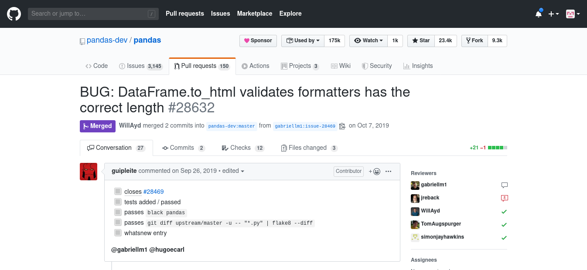
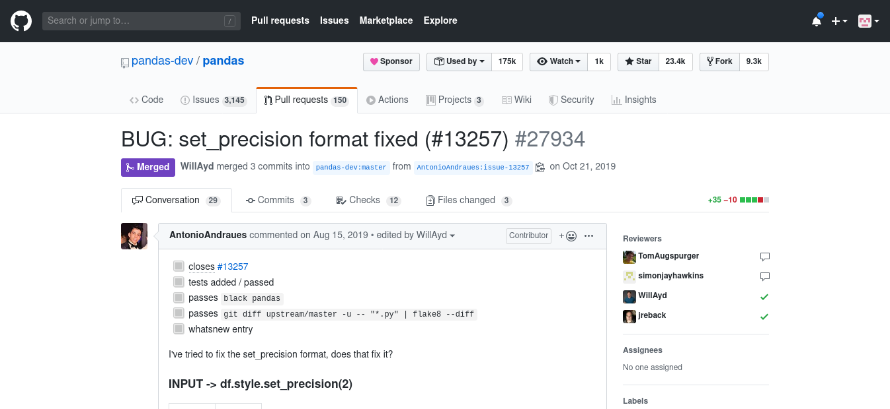
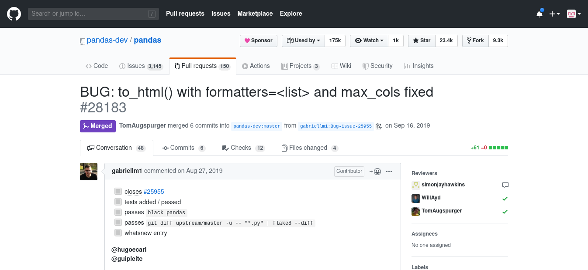
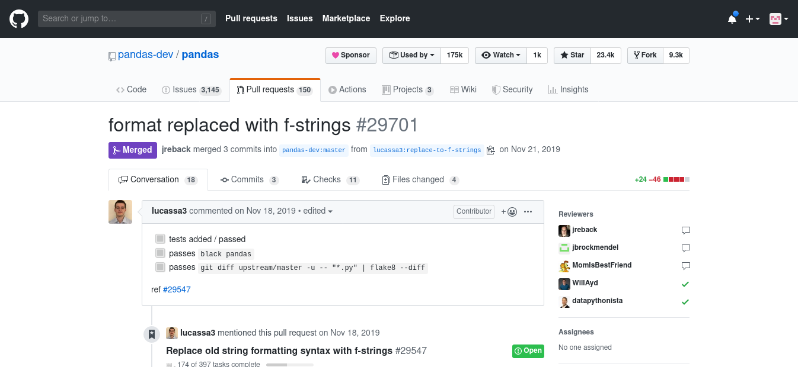
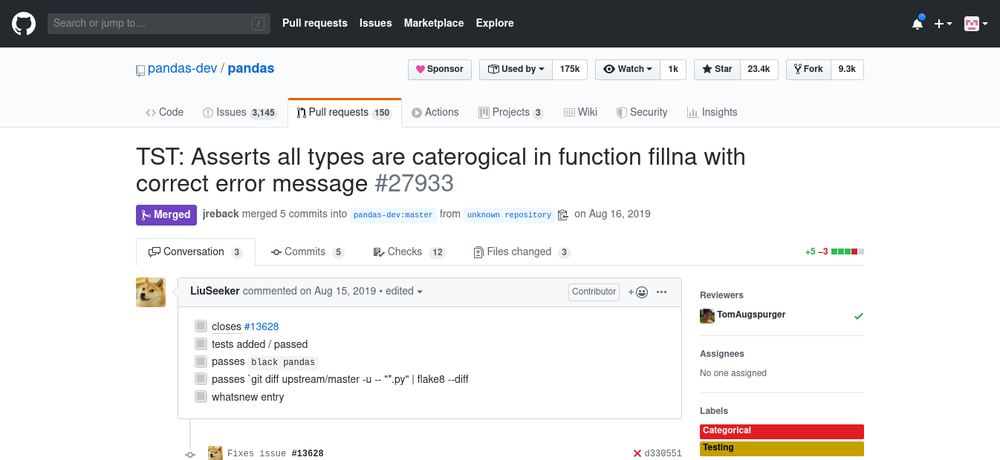

Desenvolvimento Aberto
===

# 

##### Apresentação da Disciplina + Ciclo de vida de um Bug

###### Igor dos Santos Montagner ( [igorsm1@insper.edu.br](mailto:igorsm1@insper.edu.br) )  

---

# Burocracias 

### Horários de aula:

* SEG 18:00 - 20:00
* QUA 18:00 - 20:00

### Atendimento:

* SEG 16:30 - 18:00

### Avaliação
- Curso baseado em projetos feitos individualmente com apoio de um grupo.

---

# Objetivos de Aprendizagem

Ao final da disciplina o estudante será capaz de:

- Analisar uma base de códigos desconhecida de médio/grande porte e modificá-la de modo a fazer melhorias e corrigir falhas em um software;
- Interagir com uma equipe remota de desenvolvedores para entregar código que atenda aos padrões de qualidade e estilo de código de um projeto;
- Entender as diferenças licenças de software livre e como elas impactam na distribuição e reutilização de uma base de código.

---

# Objetivos (versão resumida)

Ao final da disciplina o estudante será capaz de:

- Baixar, entender e **modificar** o código de um projeto
- Conseguir que suas modificações sejam **aceitas pelo projeto original**
- Compreender aspectos ligados a **distribuição** de software.
	- Licenças
	- Bug Tracker, Versionamento, Governança, etc
	- Documentação / Internacionalização
	- Comunidades de usuários

---

# Programa do curso

1. Modelos de desenvolvimento e comercialização de software;
2. Licenças de software e seu impacto na reutilização e distribuição;
3. Ferramentas de apoio ao desenvolvimento colaborativo de software (livre ou proprietário);
4. Documentação de software e de código;
5. Tradução e internacionalização de Software
6. Sistemas de compilação e distribuição de código fonte;
7. Aspectos humanos e comunitários em desenvolvimento de software;
8. Estudo de casos de sucesso.

---

# Livro texto

Disponível online em [https://producingoss.com](https://producingoss.com/)

---

# Materiais do curso 

Github: [https://github.com/insper/dev-aberto](https://github.com/insper/dev-aberto)

Site: [https://insper.github.io/dev-aberto/](https://insper.github.io/dev-aberto/)

Blackboard será usado para avisos somente. Todo conteúdo estará disponível no github.

---

# Justificativa da disciplina

Nas disciplinas anteriores trabalhamos 

- criando um projeto novo.
- que normalmente morre após a disciplina
- e nunca é usado por ninguém

#

No mercado, normalmente trabalhamos em um projeto existente

- corrigindo problemas
- realizando melhorias
- que é usado por vários usuários

---

# Discussão

Suponha que você decidiu liberar um projeto que você desenvolveu nos últimos semestres. Um usuário de seu software teve um problema e te contactou pedindo ajuda. 

#

Como você lidaria com isto? **10 minutos**

---

# Software é mais que um repositório!

A partir do momento em que é lançado, uma série de serviços e processos acompanha um software.

----

# Minha motivação (Igor)

## Por que a disciplina foi criada (por mim)?

----

# Minha motivação (Igor)

---

# Minha motivação (Igor)

---
 
# Minha motivação (Igor)

* Trabalhei **sozinho** durante **5 anos**
* Gastei dezenas de horas escrevendo 
	* um artigo científico sobre esta implementação.
	* documentação para usuários e desenvolvedores

#

#

* **Eu** obtive benefícios ao desenvolver esse projeto
* É possível que eu tenha resolvido um problema que nunca ninguém teve!

--- 

# Minha motivação (Igor)

## Não basta mais criar software por diversão/aprendizado

## Quero ter impacto

* Criar/contribuir com software que alguém use
* Escrever textos que alguém leia
* Participar de comunidades que sentiriam falta de mim se eu as abandonasse

----

# Quais são os resultados disso?

---

# Vitória - Turma 2

## Spyder

* Aceito: [[1]](https://github.com/spyder-ide/spyder/pull/7698)

## Pandas

* Aceito: [[1]](https://github.com/pandas-dev/pandas/pull/22737)

 

---

# Paulo - Turma 2

## Cataclysm: DDA

 

* Aceito: [[1]](https://github.com/CleverRaven/Cataclysm-DDA/pull/25764)

---

# Participações no Pandas - 2019/2

---

# Participações no Pandas - 2019/2

---

# Participações no Pandas - 2019/2

---

# Participações no Pandas - 2019/2

---

# Participações no Pandas - 2019/2

---

# Participações no Pandas - 2019/2

---

# Participações em projetos Insper - 2019

---

# Apresentação do curso

----

# Apresentação do curso

**Proposta**: Curso será *gamificado*

- Cada aluno criará um *avatar* na disciplina
- Atividades para entrega valem XP
- Cada atividade é representada por uma *skill* com um nome engraçadinho.
- Toda entrega de trabalho é via *Pull Request* no repositório da disciplina.
- **Grande liberdade de escolha**

---

# Apresentação do curso (Skills)

- Código: 
	* Pull Requests enviados a projetos;

- Tradução e documentação: 
	* melhorias em documentação de projetos e traduções de/para português;

- Comunidade: 
	* agregam valor à comunidades externas (eventos, palestras, blogs) ou à comunidade Insper

## [Lista completa de skills](https://insper.github.io/dev-aberto/regras/)

---

# Apresentação do curso (plano de aulas)

- Agosto/Setembro: **Tutorial** 
	- 30-60 minutos de expositiva/discussões
    - Atividades focadas em um tema específico
- Outubro/Novembro: Projeto
	- **Autonomia** para definir quais tarefas serão feitas
	- Escolha de projetos será semi-livre

#### Serão formados grupos para a primeira e para a segunda parte

---

# Apresentação do curso (avaliação)

* Todas as entregas são individuais
* Cada objetivo de aprendizagem é medido por várias skills.
	- Algumas são obrigatórias
	- Repetir uma skill pode valer mais ou menos pontos que a primeira vez. 
* Nota é baseada na quantidade de *XP* obtida.
	- Liberdade para decidir onde investir tempo/esforço.

---

# Apresentação do curso (avaliação)

* Nota final é uma combinação de XP e skills obtidas
* Relatório quinzenal enviado por email
* Condições completas na [página de regras e skills](https://insper.github.io/dev-aberto/regras/)

---

# Apresentação do curso (grupos)

* Grupos servem de apoio técnico e motivacional
* Bom desempenho em grupo resulta em bônus de nota :smile:
	- **Tutorial**: todos completarem as atividades antes da *AI*.
	- **Projeto**: a combinar
* Aprovação só depende do seu próprio esforço
* Alcançar conceitos altos depende da interação com seus colegas

---

# Atividade: Primeiros passos

**Objetivo**: Enviar seu primeiro *Pull Request* para o repositório da disciplina. 

---

Desenvolvimento Aberto
===

# 

##### Apresentação da Disciplina + Ciclo de vida de um Bug

###### Igor dos Santos Montagner ( [igorsm1@insper.edu.br](mailto:igorsm1@insper.edu.br) )
