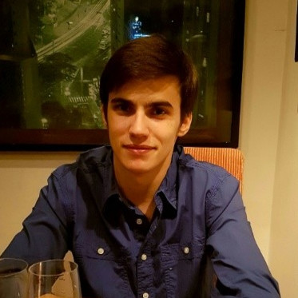

<!-- $theme: default -->

Desenvolvimento Aberto
===

# 

##### Apresentação da Disciplina + Ciclo de vida de um Bug

###### Igor dos Santos Montagner ( [igorsm1@insper.edu.br](mailto:igorsm1@insper.edu.br) )

---

# Burocracias 

### Horários de aula:

* Terça 07:30 - 09:30
* Quinta 07:30 - 09:30

### Atendimento:

* Quinta 10:00 - 11:30

### Avaliação
- Curso baseado em projetos feitos individualmente com apoio de um grupo.

----

# Livro texto

Disponível onnline em [https://producingoss.com](https://producingoss.com/)

----

# Objetivos de Aprendizagem

Ao final da disciplina o estudante será capaz de:

- Analisar uma base de códigos desconhecida de médio/grande porte e modificá-la de modo a fazer melhorias e corrigir falhas em um software;
- Interagir com uma equipe remota de desenvolvedores para entregar código que atenda aos padrões de qualidade e estilo de código de um projeto;
- Entender as diferenças licenças de software livre e como elas impactam na distribuição e reutilização de uma base de código.

---

# Objetivos (versão resumida)

Ao final da disciplina o estudante será capaz de:

- Baixar, entender e **modificar** o código de um projeto
- Conseguir que suas modificações sejam **aceitas pelo projeto original**
- Compreender aspectos ligados a **distribuição** de software.
	- Licenças
	- Bug Tracker, Versionamento, Governança, etc
	- Documentação / Internacionalização
	- Comunidades de usuários

----

# Programa do curso

1. Modelos de desenvolvimento e comercialização de software;
2. Licenças de software e seu impacto na reutilização e distribuição;
3. Ferramentas de apoio ao desenvolvimento colaborativo de software (livre ou proprietário);
4. Documentação de software e de código;
5. Tradução e internacionalização de Software
6. Sistemas de compilação e distribuição de código fonte;
7. Aspectos humanos e comunitários em desenvolvimento de software;
8. Estudo de casos de sucesso.

-----

# Materiais do curso 

Github: [https://github.com/insper/dev-aberto](https://github.com/insper/dev-aberto)

Site: [https://insper.github.io/dev-aberto/](https://insper.github.io/dev-aberto/)

Blackboard será usado para avisos somente. Todo conteúdo estará disponível no github.

---

# Motivação burocrática

Nas disciplinas anteriores trabalhamos 

- criando um projeto novo.
- que normalmente morre após a disciplina
- e nunca é usado por ninguém

#

No mercado, normalmente trabalhamos em um projeto existente

- corrigindo problemas
- realizando melhorias
- que é usado por vários usuários

---

# Atividade: Por que vocês estão aqui?

**Objetivo:** descobrir suas

* Expectativas
* Vontades
* Gostos

### Sem julgamentos ou filtros!

---

# Vitória - Turma 2

## Spyder

* Aceito: [[1]](https://github.com/spyder-ide/spyder/pull/7698)

## Pandas

* Aceito: [[1]](https://github.com/pandas-dev/pandas/pull/22737)

 

---

# Paulo - Turma 2

## Cataclysm: DDA

 

* Aceito: [[1]](https://github.com/CleverRaven/Cataclysm-DDA/pull/25764)

----

# Efeiche - Turma 1

## Jupyter Notebook

* Aceito: [[1]](https://github.com/jupyter/notebook/pull/3949) 
* Enviado [[2]](https://github.com/jupyter/notebook/pull/4030)

 

---

# Marcelo - Turma 1

## Elementary OS

 

* Switchboard - Enviado: [[1]](https://github.com/elementary/switchboard-plug-about/pull/67) [[2]](https://github.com/elementary/switchboard-plug-mouse-touchpad/pull/44)

* Code editor - Enviado: [[1]](https://github.com/elementary/code/pull/511)

---

# Atividade: Por que vocês estão aqui?

1. Formem grupos de 4 pessoas 
	* Serão o mesmo até a AI
2. **5 minutos**: uma razão de estar na matéria por post-it
3. Um por vez, cada membro cola seu post-it na folha A3
	* Se você tiver algo parecido, cole junto
4. Elejam um do grupo para mostrar seu trabalho.

----------

# Motivação (Igor)

----------

# Motivação (Igor)

----------
 
# Motivação (Igor)

* Trabalhei **sozinho** durante **5 anos**
* Gastei dezenas de horas escrevendo 
	* um artigo científico sobre esta implementação.
	* documentação para usuários e desenvolvedores

#

#

* **Eu** obtive benefícios ao desenvolver esse projeto
* É possível que eu tenha resolvido um problema que nunca ninguém teve!

---- 

# Motivação (Igor)

## Não basta mais criar software por diversão/aprendizado

## Quero ter impacto

* Criar software que alguém use
* Escrever textos que alguém leia
* Participar de comunidades que sentiriam falta de mim se eu as abandonasse

## 

----------

# Atividade: Por que vocês estão aqui?

1. Formem grupos de 4 pessoas 
	* Serão o mesmo até a AI
2. **5 minutos**: uma razão de estar na matéria por post-it
3. Um por vez, cada membro cola seu post-it na folha A3
	* Se você tiver algo parecido, cole junto
4. Elejam um do grupo para mostrar seu trabalho.

### Revisitaremos esse painel no fim do curso

-----

# Apresentação do curso

**Proposta**: Curso será *gamificado*

- Cada aluno criará um *avatar* na disciplina
- Atividades para entrega valem XP
- Cada atividade é representada por uma *skill* com um nome engraçadinho.
- Toda entrega de trabalho é via *Pull Request* no repositório da disciplina.
- **Grande liberdade de escolha**

---

# Apresentação do curso (Skills)

- Código: 
	* Pull Requests enviados a projetos;

- Tradução e documentação: 
	* melhorias em documentação de projetos e traduções de/para português;

- Comunidade: 
	* agregam valor à comunidades externas (eventos, palestras, blogs) ou à comunidade Insper

-----

# Apresentação do curso (plano de aulas)

- Agosto/Setembro: **Tutorial** 
	- 30-60 minutos de expositiva/discussões
    - Atividades focadas em um tema específico
- Outubro/Novembro: Projeto
	- sprints de ~2 semanas
	- **Autonomia** para definir quais tarefas serão feitas
	- Escolha de projetos será semi-livre

#### Serão formados grupos para a primeira e para a segunda parte

----

# Apresentação do curso (avaliação)

* Todas as entregas são individuais
* Cada objetivo de aprendizagem é medido por várias skills.
	- Algumas são obrigatórias
* Nota é baseada na quantidade de *XP* obtida.
	- Liberdade para decidir onde investir tempo/esforço.

----

# Apresentação do curso (avaliação)

* **Conceito I**: não fez mais da metade das atividades do tutorial.
* **Conceito D**: não fez alguma das atividades do tutorial.
* **Conceito C**: 60XP (individual) **E** uma skill de cada área
* **Conceito B**: 100XP **E** *PR aceito* ou equivalente
* **Conceito A+**: 200XP

----------

# Apresentação do curso (grupos)

* Grupos servem de apoio técnico e motivacional
* Bom desempenho em grupo resulta em bônus de nota :smile:
	- **Tutorial**: todos completarem as atividades antes da *AI*.
	- **Projeto**: colaborar e cumprir a dedicação combinada.
* Aprovação só depende do seu próprio esforço
* Alcançar conceitos altos depende do esforço do grupo como um todo

---

# Atividade: Primeiros passos

**Objetivo**: Enviar seu primeiro *Pull Request* para o repositório da disciplina. 

----

# Atividade: Expectativas

**Objetivo**: Criar uma equipe no repositório da disciplina e adicionar a foto do painel criado na aula de hoje. 

----

# Tarefa complementar

Se você já acabou o roteiro da aula, leia o Capítulo 3 **Technical Infrastructure** do livro *"Producing Open Source Software*"

---

Desenvolvimento Aberto
===

# 

##### Apresentação da Disciplina + Ciclo de vida de um Bug

###### Igor dos Santos Montagner ( [igorsm1@insper.edu.br](mailto:igorsm1@insper.edu.br) )
