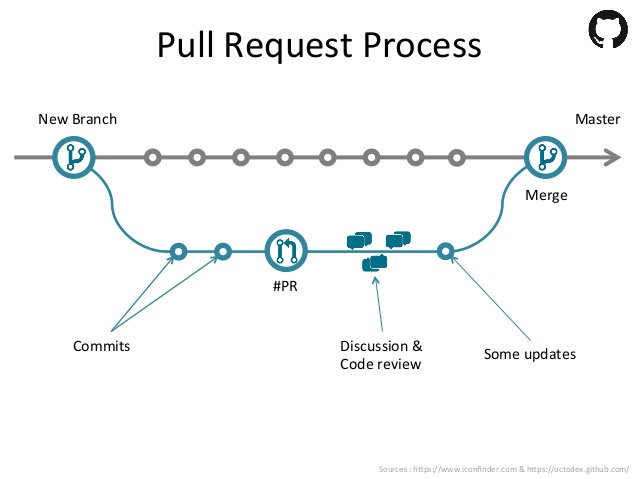

Desenvolvimento Aberto
===

# 

##### Primeira contribuição de código

###### Igor dos Santos Montagner ( [igorsm1@insper.edu.br](mailto:igorsm1@insper.edu.br) )

---

# Aulas passadas

* Objetivos e motivações
* Fez uma primeira tentativa de PR para se adicionar ao repo da disciplina

---

# Hoje

### Atividades

* Revisar PR da aula anterior
* Adicionar equipe no repositório
* Escolher projeto e issue para primeira contribuição

### Expositiva

* Fluxo de trabalho: modelo de Pull Request
	- `revert`
	- `rebase`

---

# Revisão dos PRs da aula passada

## Erros comuns

---

# Erro 1: arquivos extras no PR

**Erro**: modificar arquivos não relacionados a sua mudança proposta.

#

**Ideal**: 

1. Um Pull Request deverá conter o somente os arquivos relacionados a modificação proposta. 
1. Cada modificação proposta está em um Pull Request separado

----

---

# Erro 1: arquivos extras no PR

**Como consertar**: `git revert` cria um commit que desfaz alterações anteriores.

.svg?cdnVersion=501)

**Opções extras**:

* `--no-commit`: só adiciona as modificações, mas não faz o commit. Permite desfazer parcialmente um commit. 

Fonte: https://www.atlassian.com/git/tutorials/

----

# Erro 2: PR contém mais de um commit

**Erro**: o PR está espalhado em vários commits. 

#

**Ideal**: 

1. Colocar toda sua modificação em um só commit ajuda a entender o que foi modificado no PR.
1. Mantém histórico limpo, com um commit por bug consertado ou funcionalidade adicionada.
1. Facilita encontrar erros e desfazer a modificação caso ela seja problemática (usando `git revert')

---

# Erro 2: PR contém mais de um commit

----

# Erro 2: PR contém mais de um commit

**Como consertar**: `git rebase -i master` permite remover e juntar commits do branch atual que não estejam no `master`. 

Fonte: https://www.atlassian.com/git/tutorials/

----
# Erro 3: Mensagens de commit não descritivas

**Como consertar**: `git commit --amend` permite modificar o último commit feito. 

---

# Atividade

**Objetivo**: corrigir seu PR e cumprir a última parte do roteiro da última aula.

----

# Fluxo de trabalho

### Sistemas de controle de versão distribuídos

-----

# Modelo 1: Pull Request

  Fonte: https://www.slideshare.net/abderrahmanebenbachir/continuous-integration-in-github 

---

# Modelo 1: Pull Request

  Fonte: https://www.slideshare.net/abderrahmanebenbachir/continuous-integration-in-github 

---
# Fluxo de Trabalho: outros modelos

1. Enviar patch via lista de e-mails (ex. Linux)
2. Ferramentas de *code review* (ex. KDE - Phabricator)
3. Patch é anexado no Bug Tracker (ex. Haiku, KDE)
4. Não recebe contribuições externas

----

# Minha primeira contribuição de código

* Projetos e issues pré-selecionados
* Será feita em duplas duas vezes
	* cada vez um será o responsável
	* ajudar a desempacar
* Teremos 2 aulas dedicadas para esta primeira contribuição

----

# Pandas 

Biblioteca de tratamento de dados usada em Ciência dos Dados. 

* Projeto complexo, com muitos casos de uso especiais
* Toneladas de funcionalidades de visualização textual e gráfica de dados

Qual seria nosso [impacto](https://github.com/pandas-dev/pandas/graphs/contributors)?

----

# Pandas (Issues)

### Formatação

* [[1]](https://github.com/pandas-dev/pandas/issues/27563), [[2]](https://github.com/pandas-dev/pandas/issues/13257), [[3]](https://github.com/pandas-dev/pandas/issues/25955)

### Pré-processamento

* [[1]](https://github.com/pandas-dev/pandas/issues/13628), [[2]](https://github.com/pandas-dev/pandas/issues/18198), [[3]](https://github.com/pandas-dev/pandas/issues/16698)

### Entrada/saída:

* [[1]](https://github.com/pandas-dev/pandas/issues/26692), [[2]](https://github.com/pandas-dev/pandas/issues/22853)

### Visualização

* [[1]](https://github.com/pandas-dev/pandas/issues/14119)

---

# Sphinx

Projeto para documentação de projetos. Usado para documentar o próprio Python.

* Trabalha com textos em diversos formatos
* Faz referência entre documentos e com código fonte.

[Nosso impacto](https://github.com/sphinx-doc/sphinx/graphs/contributors)

---

# Sphinx (issues)

### Exemplos

* [[1]](https://github.com/sphinx-doc/sphinx/issues/4731) 

### Documentos e formatação

* [[1]](https://github.com/sphinx-doc/sphinx/issues/6241) [[2]](https://github.com/sphinx-doc/sphinx/issues/6094) [[3]](https://github.com/sphinx-doc/sphinx/issues/4925)

---

# Outros projetos

1. Electron (tecnologias web para criar programas Desktop)
2. Godot engine (motor de jogos + editor)
3. Nikola (gerador de sites estáticos)

----

# Outras fontes de projetos

* https://github.com/MunGell/awesome-for-beginners
* https://www.codetriage.com/
* https://up-for-grabs.net/#/
* http://github-help-wanted.com/

Sugestões: Marcelo e Gustavo (turma 1)

----

# Como procurar

Bons projetos usam tags para facilitar a recepção de novatos

* good-first-issue
* newcomers
* help wanted
* low effort
* difficulty novice
* easy

---
# 

##### Em direção a sua primeira contribuição

