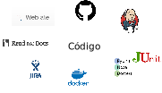
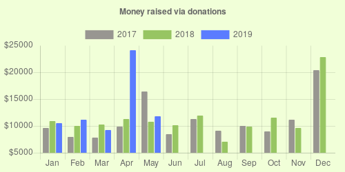

Desenvolvimento Aberto
===

# 

##### Comunidades de Software

###### Igor dos Santos Montagner ( [igorsm1@insper.edu.br](mailto:igorsm1@insper.edu.br) )

---

# Aula passada

- Objetivos e motivações 

- Fluxo de trabalho para contribuição
	- Forks, branch e PR
	- Descentralizado

---

# Hoje 

- Projeto é mais que código

- Responder às seguintes perguntas
	- Quem contribui com SL?
	- Quem paga por contribuições?
	- Como projetos se organizam?
	- Como começar a contribuir?

---

# Discussão

Suponha que você decidiu liberar um projeto que você desenvolveu nos últimos semestres. Um usuário de seu software teve um problema e te contactou pedindo ajuda. 

#

Como você lidaria com isto? **10 minutos**

---

# Arquitetura ao redor do código

#

Uma série de serviços e processos acompanha um software.

-----

# Atividade

#

**Pergunta**: quais são os softwares que vocês mais utilizam no dia a dia?
#
#
#
.

---
# Atividade

#

**Pergunta**: quais são os softwares que vocês mais utilizam no dia a dia?
#
#
#
**Pergunta 2**: quem é o principal desenvolvedor do projeto?

----

# Exemplo: Kernel Linux

Fundação dá suporte ao desenvolvimento do Kernel Linux e à criação de um ecossistema de software de código aberto ao seu redor.

Apoio:

* Financeiro
* Propriedade intelectual
* Infraestrutura
* Serviços e treinamento

---
# Exemplo: Kernel Linux

Empresas que patrocinam desenvolvimento:

1. Intel (13.1%)
2. Indivíduos (8.2 %)
3. Red Hat (7.2%)
4. Linaro (5.6%)
5. Desconhecido (4.1%)
6. IBM (4.1%)
7. Consultores (3.3%)
8. Samsung (3.2%)
9. SUSE (3.0%)
10. Google (2.7%)

Fonte: "2017 Linux Kernel Development Report"

---
# Exemplo: Ubuntu

#
#

#
#

Empresa privada controla o desenvolvimento do Ubuntu. Obtem recursos via

* Doações
* Serviços de desenvolvimento e consultoria
* Treinamento

---
# Exemplo: Gitlab

#
#

#
# 

Empresa financiada até agora por VC (Venture Capital) em busca de lucro. 

* Opção de planos grátis com software de código aberto
* Opção de planos corporativos com mais funcionalidades e **suporte**
* Instalações locais

---
# Exemplo: Elementary

#

#

Distribuição linux comandada por uma empresa "minúscula" focada em experiência de usuário. Recursos são obtidos via

* Doações
* Compras na loja AppCenter

---

---

# Exemplo: Linux Mint

#

Distribuição linux cujo objetivo é que tudo funcione direto na instalação. É considerada boa para iniciantes. 

---	

---

----

---

# Outras fontes

Diversas outras maneiras de conseguir suporte e financiamento

---
# Razões para financiar (empresa)
#
- "Adquirir" especialistas em uma tecnologia
- Vender suporte ou consultoria
- Marketing
- Licença de software "obriga" 
#
#

Nem sempre o que é financiado termina em um formato "aproveitável" por terceiros (ex: Android/Linux, TiVO)

---
# Razões para contribuir (indivíduo)

- Profissionais
	- Reputação / Currículo
	- Necessidade de negócio
- Pessoais
	- Altruísmo / Ideologia
	- Sensação de realização pessoal
	- Exercício de criatividade
	- Resolver um problema de seu interesse

---
# Como começar a contribuir?

---
# Atividade

* Pesquisar como as comunidades de alguns projetos estão organizadas
* Produzir uma apresentação resumindo suas descobertas

#

Mais detalhes no roteiro da aula.

---
# Atividade 

Licenças de trabalhos artísticos/criativos:

#

#

* Todo trabalho criativo é "privado": criador controla distribuição
* Licenças CC permitem a distribuição sob termos pouco restritivos

#

Vamos falar de licenças de software com cuidado mais para frente!

---

Desenvolvimento Aberto
===

# 

##### Comunidades de Software

