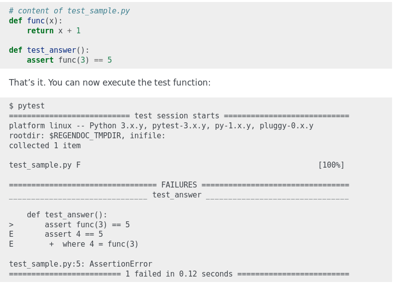

Desenvolvimento Aberto
===

##### Documentação de API e linters

###### Igor dos Santos Montagner ( [igorsm1@insper.edu.br](mailto:igorsm1@insper.edu.br) )

---
# Código *vs* software profissional

Os seguintes pontos transformam um código que fiz para mim em algo útil para outras pessoas

1. Traduções e internacionalização (datas)
2. Documentação de usuário 
3. Documentação de desenvolvimento

---
# Código *vs* software profissional

Os seguintes pontos transformam um código que fiz para mim em algo útil para outras pessoas

1. Traduções e internacionalização (datas)
2. Documentação de usuário 
3. Documentação de desenvolvimento
	- Estrutura de projeto
	- **API**

---
# Hoje

* Documentação de API usando 
	- pydoc
	- sphinx-autodoc
* Padrões de formatação de código
	- linters
	- PEP8

---
# Documentação de API

**Objetivo**: explicar o funcionamento das funções, classes e módulos de um programa. 

* Focado em detalhes
* Documenta os argumentos esperados e em quais situações a função funciona 
* Tipicamente obtida direto do código

---
# Documentação de API

---
# Documentação de API

[ref](https://docs.scipy.org/doc/numpy/reference/generated/numpy.dot.html)

---
# Ferramentas

* Python:
	- pydoc, **sphinx-apidoc**
* C/C++
	- Doxygen
* Java
	- Javadoc

---
# Padrões de codificação

---
# Padrões de codificação

---
# Padrões de codificação

* Cada projeto tem o seu
* Algumas linguagens tem um estilo padrão
	- Python - PEP8
* Ferramentas ajudam a conferir (forçar) um estilo específico

---
# Ferramentas

* Python: pylint
* C/C++: splint, cppchecker, gcc (opções -Wall, -Wextra)
* Java: flag `-Xlint`
* Javascript: ESlint, TSlint (typescript)

#

Ajudam a manter código limpo e legível. Podem ser plugadas no seu editor/IDE favorito.

---
# Testes automatizados

**Ideia**: escrever um programa que verifica se um outro programa responde como esperado

* Definir situações a serem testadas ...
* e o resultado esperado em cada situação

---
# Testes automatizados

**Não ajudam**:

* a revelar novos bugs
* a garantir que um software é livre de bugs

**Ajudam**

* a evitar que bugs descobertos voltem
* a evitar que mudanças não intencionais quebrem código que estava funcionando.
* a documentar em quais situações o software funciona.

---
# Testes unitários

**Ideia**: dada uma função, verificar se ela devolve o valor esperado para um certo conjunto de parâmetros. 

* Testa as funções de maneira **isolada**
* **Cobertura**: porcentagem das linhas de código que é executada durante os testes de unidade.
* Serve como documentação da função

---
# Testes unitários - pytest

---

## **O quê eu preciso testar?**

# 

# 

Ninguém sabe de verdade.... 

----
# Atividade prática

Transformar um código perdido em um projeto "completo"

**Skill**: Projeto profissional
**Proof**: url da página do projeto criada por vocês. 

Mais instruções no roteiro da aula. 

---

Desenvolvimento Aberto
===

##### Documentação de API + testes

###### Igor dos Santos Montagner ( [igorsm1@insper.edu.br](mailto:igorsm1@insper.edu.br) )

