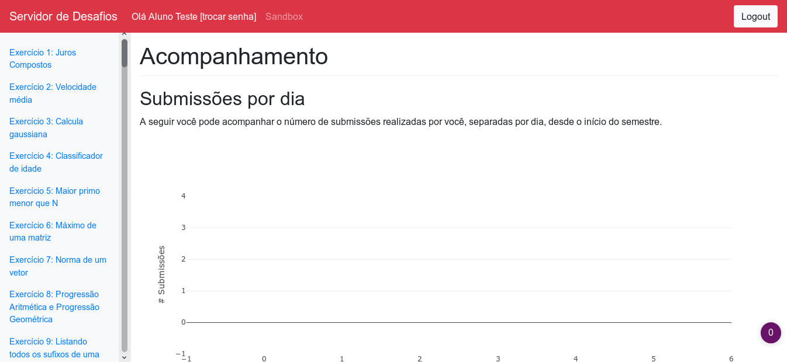

Desenvolvimento Aberto
===

##### Comunidade Insper

###### Igor dos Santos Montagner ( [igorsm1@insper.edu.br](mailto:igorsm1@insper.edu.br) )

---
# Visão Geral

Trabalhamos três frentes no curso:

## Código

Contribuições e PRs enviados a projetos externos

---
# Visão Geral

Trabalhamos três frentes no curso:

## Tradução e Localização

Permitir que pessoas de diferentes países usem software e aprendam sobre tecnologia em geral

---
# Visão Geral

Trabalhamos três frentes no curso:

## Comunidades

* Interação com pessoas que desenvolvem e usem software (livre). 
* Atividades de serviço a comunidades

---

# Comunidade Insper

## Projetos educacionais livres 

* Servidor de Desafios - Design de Software
* Corretor Automático - Lógica da Computação
* Insper handout
* Outros projetos "perdidos" no Github do Insper

----

# Comunidade Insper

* Software com fins pedagógicos 
* Melhorar aprendizado dos alunos
	* Feedback mais rápido
	* Melhor acompanhamento de progresso
	* Menor carga de correção = mais tempo para interação com alunos

----

# Comunidade Insper

## Por quê participar?

* Vontade de melhorar o curso
* Reconhecimento dos pares
* Impacto em escala menor e mais pessoal
* Criação de uma cultura de curso colaborativa

-------
# Comunidade Insper

## Servidor de desafios

-------
# Comunidade Insper

## Servidor de desafios

* Exercícios básicos categorizados por assunto (funções, if, while, etc)
* Correção automática
* Interface para editar o código direto no browser
* Acompanhamento de progresso dos alunos para o professor

-------
# Comunidade Insper

## Servidor de desafios

* Muitas issues de co-design para melhorar usabilidade
* Algumas features novas: 
	- Melhorias no corretor automático
	- Refatoração de código
	- Testes públicos e privados (somente professor pode ver se passou)

[Repositório do Github](https://github.com/insper/servidor-de-desafios/issues)

-------
# Comunidade Insper

## Corretor automático - Lógica da Computação

* Alunos implementam linguages de programação
* Sistema que baixa os projetos dos alunos e verifica se suas implementações retornam os resultados esperados
* Erros são reportados usando issues no Github

-------
# Comunidade Insper

## Corretor automático - Lógica da Computação

* Só funciona para uma linguagem por vez
* Scripts feitos em *bash* dificultam comportamentos mais complexos
* Testes são feitos no olhômetro. Ideal seria implementar testes de unidade

[Repositório do Github](https://github.com/Insper/LogCompTester)

-------
# Comunidade Insper

**Skill**: Projeto DIY

**Metadata**: link para o PR aceito

### Mínimo 1 por grupo

---
Desenvolvimento Aberto
===

##### Comunidade Insper

###### Igor dos Santos Montagner ( [igorsm1@insper.edu.br](mailto:igorsm1@insper.edu.br) )

