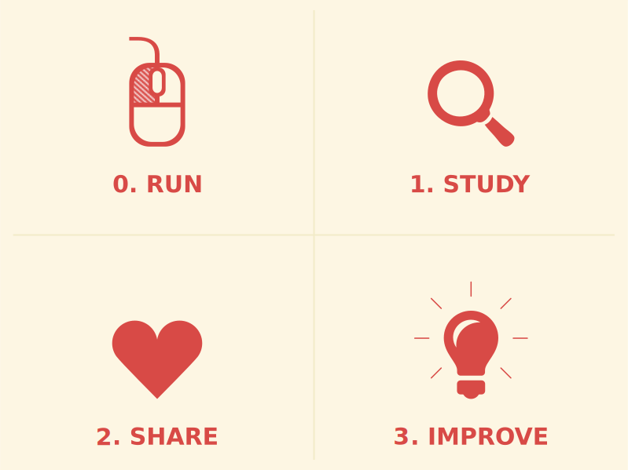
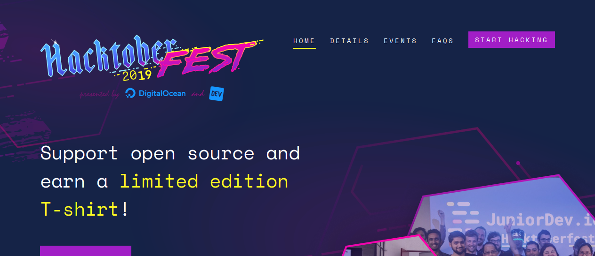

Desenvolvimento Aberto
===

##### Projeto da disciplina

###### Igor dos Santos Montagner ( [igorsm1@insper.edu.br](mailto:igorsm1@insper.edu.br) )

---
# Hacktoberfest

* Valerá **20XP** além do já obtido com os 4 PRs. 
* Pelo menos 3 PRs tem que ser para outros repos

---
# Até a AI

* Ferramentas de colaboração
* Modificações de código
* Tradução de UI e documentação
* Aspectos "tavngenciais" relacionados
    - licenças
    - comunidades

----

# Até a AI

## Formação básica

# A partir de agora

## Produtividade

---
# Projeto Aberto

**Objetivos**: 

1. proporcionar uma experiência de trabalho em um projeto real em que exista interação com outros desenvolvedores. 
2. valorizar diversos tipos de contribuições, não somente de código
3. exercitar autonomia e independência

---
# Projeto Aberto

## Organizado em Sprints

* 10/10 -> 22/10
* 22/10 -> 05/11
* 05/11 -> 19/11
* 03/12 (fechamento com cada grupo)

---
# Avaliação 

## Individual

* Skills enviadas durante o projeto
    
> "metadata": {"project": ["login1", "login2], ... }

* Aprovação depende da quantidade de pontos submetidas pelo seu usuário
* [Regras e skills](https://insper.github.io/dev-aberto/regras/) disponíveis no [site da disciplina](https://insper.github.io/dev-aberto/)

---
# Avaliação
  
## Grupo

* questionários a cada fim de sprint
* produção durante cada sprint
* bônus de `0%, 10%, 30%, 50%` da **média** da pontuação do resto do grupo 
* avaliação subjetiva do professor

----
# Reflexão 1

## Qual será minha dedicação ao projeto da disciplina?

----
# Reflexão 2

## Onde está minha motivação intrínseca?

---
# Reflexão 3 

## Qual a direção que meu grupo quer tomar?

---
# Início de sprint

## Siga as instruções do handout

----
Desenvolvimento Aberto
===

##### Projeto da disciplina

###### Igor dos Santos Montagner ( [igorsm1@insper.edu.br](mailto:igorsm1@insper.edu.br) )
