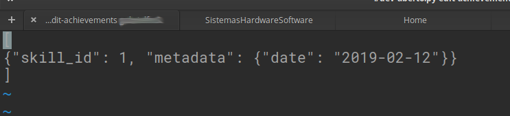
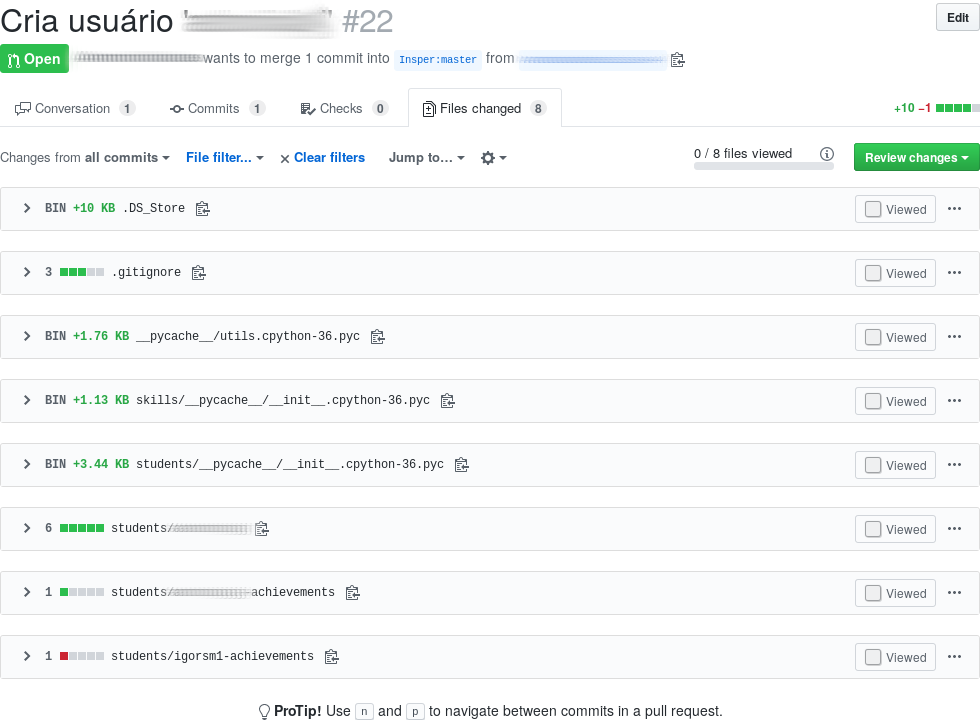
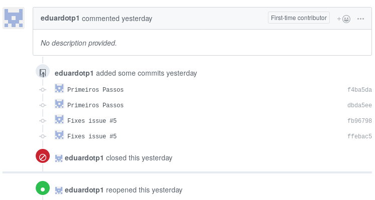
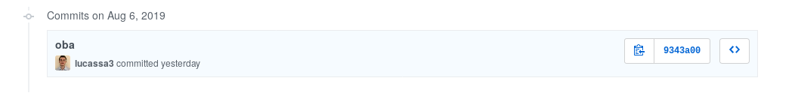
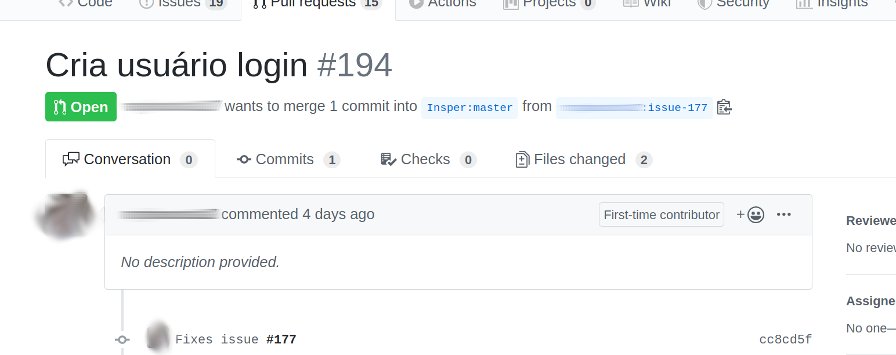
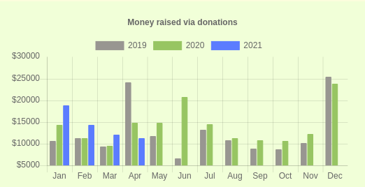

<style>
	footer {
		position: fixed;
		bottom: 10px;
		left: 1050px;
		width: 400px;
	}

	footer img {
		vertical-align: middle;
	}
</style>


Desenvolvimento Aberto
===

# 

##### Fluxo de trabalho distribuído e Comunidades de Software


###### Versão 2022/2: Fabrício Barth ( [fabriciojb@insper.edu.br](mailto:fabriciojb@insper.edu.br) )  

-----

# Modelo Github *fork + pull request*


  Fonte: https://www.slideshare.net/abderrahmanebenbachir/continuous-integration-in-github 


---

# Modelo Github *fork + pull request*


  Fonte: https://www.slideshare.net/abderrahmanebenbachir/continuous-integration-in-github 

---

# Fluxo de Trabalho: outros modelos

1. Enviar patch via lista de e-mails (ex. Linux)
2. Ferramentas de *code review* (ex. KDE - Phabricator)
3. Patch é anexado no Bug Tracker (ex. Haiku, KDE)
4. Não recebe contribuições externas

----


# Revisão dos PRs da aula passada

## Erros comuns

---

# Erro 0: o arquivo *login-achievements*



**Como consertar**: Crie um novo commit com a data certa e veja o erro 2.

-----

# Erro 1: arquivos extras no PR

**Erro**: modificar arquivos não relacionados a sua mudança proposta.

#

**Ideal**: 

1. Um Pull Request deverá conter o somente os arquivos relacionados a modificação proposta. 
1. Cada modificação proposta está em um Pull Request separado

----



---

# Erro 1: arquivos extras no PR

**Como consertar**: `git revert` cria um commit que desfaz alterações anteriores.


.svg?cdnVersion=501)


**Opções extras**:

* `--no-commit`: só adiciona as modificações, mas não faz o commit. Permite desfazer parcialmente um commit. 

Fonte: https://www.atlassian.com/git/tutorials/

----

# Erro 2: PR contém mais de um commit

**Erro**: o PR está espalhado em vários commits. 

#

**Ideal**: 

1. Colocar toda sua modificação em um só commit ajuda a entender o que foi modificado no PR.
1. Mantém histórico limpo, com um commit por bug consertado ou funcionalidade adicionada.
1. Facilita encontrar erros e desfazer a modificação caso ela seja problemática (usando `git revert')


---


# Erro 2: PR contém mais de um commit




----


# Erro 2: PR contém mais de um commit

**Como consertar**: `git rebase -i master` permite remover e juntar commits do branch atual que não estejam no `master`. 


Fonte: https://www.atlassian.com/git/tutorials/

----
# Erro 3: Mensagens de commit não descritivas



**Como consertar**: `git commit --amend` permite modificar o último commit feito. 

----
# Erro 4: Pull Request com descrição ruim



**Como consertar**: Só editar na interface do Github. 

---

# Consertar em casa e pedir review via Github

### Lembrete: se não der push não estragou nada

### Lembrete II: `git log` mostra seu histórico atual

### Dica: se modificou commits já publicados use `git push -f` para sobrescrever 

---

# Nem todos os alunos que estão matriculados na disciplina fizeram a atividade da última aula! 

```bash
python dev-aberto.py list-users
```

---

# Comunidades de software

----
# Discussão

#

**Pergunta 1**: quais são os softwares que vocês mais utilizam no dia a dia?
#
#
#
**Pergunta 2**: quem é o principal desenvolvedor do projeto?

----

# Exemplo: Kernel Linux


Fundação dá suporte ao desenvolvimento do Kernel Linux e à criação de um ecossistema de software de código aberto ao seu redor.

Apoio:

* Financeiro
* Propriedade intelectual
* Infraestrutura
* Serviços e treinamento

---
# Exemplo: Kernel Linux

Empresas que patrocinam desenvolvimento:

1. Individuais (11,95%)
1. Intel (10,01%)
3. Red Hat (8,90%)
4. Desconhecido (4,09%)
5. IBM (3,79%)
6. SUSE (3,49%)
7. Linaro (2,96%)
8. Consultores (2,96%)
9. Google (2,79%)
10. Samsung (2,28%)

Fonte: "2020 Linux Kernel Development Report"

---
# Exemplo: Ubuntu

#
#


#
#

Empresa privada controla o desenvolvimento do Ubuntu. Obtem recursos via

* Doações
* Serviços de desenvolvimento e consultoria
* Treinamento

---
# Exemplo: Gitlab

#
#


#
# 

Empresa financiada até agora por VC (Venture Capital) em busca de lucro. 

* Opção de planos grátis com software de código aberto
* Opção de planos corporativos com mais funcionalidades e **suporte**
* Instalações locais

---
# Exemplo: Elementary

#


#

Distribuição linux comandada por uma empresa "minúscula" focada em experiência de usuário. Recursos são obtidos via

* Patrocínios individuais e por empresas
* Modelo pay-what-you-want (loja de aplicativos e sistema operacional)
* Hardware com o sistema pré-instalado

---


---

# Exemplo: Linux Mint


#

Distribuição linux cujo objetivo é que tudo funcione direto na instalação. É considerada boa para iniciantes. 


---	


---




----


---

# Outras fontes


Diversas outras maneiras de conseguir suporte e financiamento


---
# Razões para financiar (empresa)
#
- "Adquirir" especialistas em uma tecnologia
- Vender suporte ou consultoria
- Marketing
- Licença de software "obriga" 
#
#

Nem sempre o que é financiado termina em um formato "aproveitável" por terceiros (ex: Android/Linux, TiVO)

---

*"Tivoization is the practice of designing hardware that incorporates software under the terms of a copyleft software license like the GNU General Public License (GNU GPL), but uses hardware restrictions or digital rights management (DRM) to prevent users from running modified versions of the software on that hardware"* [Wikipedia]

---
# Razões para contribuir (indivíduo)

- Profissionais
	- Reputação / Currículo
	- Necessidade de negócio
- Pessoais
	- Altruísmo / Ideologia
	- Sensação de realização pessoal
	- Exercício de criatividade
	- Resolver um problema de seu interesse

---
# Atividade: Explorando o entorno de um projeto


* Pesquisar como as comunidades de alguns projetos estão organizadas
* Produzir uma apresentação resumindo suas descobertas


------------

Desenvolvimento Aberto
===

# 

##### Fluxo de trabalho distribuído e Comunidades de Software

