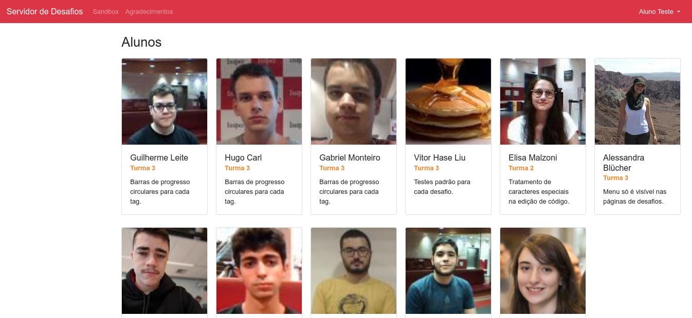

Desenvolvimento Aberto
===

##### (A ausência de d)ocumentação de software

###### Igor dos Santos Montagner ( [igorsm1@insper.edu.br](mailto:igorsm1@insper.edu.br) )

----

# Discussão: o que faz o projeto?

---

# Servidor de desafios

Vocês rodaram um MVP do servidor de desafios. Veja abaixo seu estado atual:

https://github.com/Insper/servidor-de-desafios

----

# Servidor de desafios

----

# Discussão: como o projeto está organizado? (tecnologias)

----

# Discussão: como o projeto está organizado? (código)

----

# Discussão: avalie a arquitetura do projeto 

## 0 a 10

----

# Discussão: avalie a qualidade de código do projeto. 

## 0 a 10

----

# Discussão: avalie a segurança do projeto. 

## 0 a 10

----

# Discussão: esse projeto é um projeto "profissional"?

## 0 a 10

----

# Discussão: o que você incluiria na documentação do projeto?

----

# Próximas aula

Entender o quê é um projeto **profissional**: 

* documentação de usuário e desenvolvedor
* boas práticas de programação e qualidade de código
* integração de código e documentação em um mesmo repositório

----

Desenvolvimento Aberto
===

##### (A ausência de d)ocumentação de software

###### Igor dos Santos Montagner ( [igorsm1@insper.edu.br](mailto:igorsm1@insper.edu.br) )

