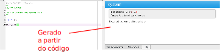
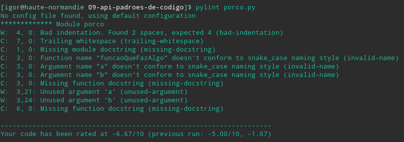

Desenvolvimento Aberto
===

##### Documentação de API e linters

###### Igor dos Santos Montagner ( [igorsm1@insper.edu.br](mailto:igorsm1@insper.edu.br) )

----

# Servidor de desafios

* Arquitetura
* Qualidade de código
* Segurança

## Software tem história e depende de pessoas para evoluir

---

# Código *vs* software profissional

Os seguintes pontos transformam um código que fiz para mim em algo útil para outras pessoas

1. Traduções e internacionalização (datas)
2. Documentação de usuário e de desenvolvimento
3. Algum processo de qualidade de software
	* testes automatizados
	* formatação de código e estrutura de repo
4. pacotes de instalação

---
# Hoje

* Ferramentas de documentação
* Documentação de API usando
* Padrões de formatação de código
	- linters
	- PEP8

---
# Documentação de API

**Objetivo**: explicar o funcionamento das funções, classes e módulos de um programa. 

* Focado em detalhes
* Documenta os argumentos esperados e em quais situações a função funciona 
* Tipicamente obtida direto do código
* Não detalha como as funções são usadas em conjunto

---
# Documentação de API

---
# Documentação de API

[ref](https://docs.scipy.org/doc/numpy/reference/generated/numpy.dot.html)

---
# Ferramentas

* Python:
	- pydoc, numpydoc
* C/C++
	- Doxygen
* Java
	- Javadoc

Em geral podem ser plugadas em alguma ferramenta de documentação de projetos. 

---
# Padrões de codificação

---
# Padrões de codificação

---
# Padrões de codificação

* Cada projeto tem o seu
* Algumas linguagens tem um estilo padrão
	- Python - PEP8
* Ferramentas ajudam a conferir (forçar) um estilo específico

---
# Ferramentas

* Python: pylint, black
* C/C++: splint, cppchecker, gcc (opções -Wall, -Wextra)
* Java: flag `-Xlint`
* Javascript: ESlint, TSlint (typescript)

#

Ajudam a manter código limpo e legível. Podem ser plugadas no seu editor favorito.

## Execução obrigatória para muitos projetos grandes

----

# Atividade prática: Projeto profissional

**Objetivo**: Transformar um código perdido em um projeto "completo"

> "metadata": {"url": "github pages criado", "group": ["ate três", "alunos"]}

---

Desenvolvimento Aberto
===

##### Documentação de API + testes

###### Igor dos Santos Montagner ( [igorsm1@insper.edu.br](mailto:igorsm1@insper.edu.br) )

