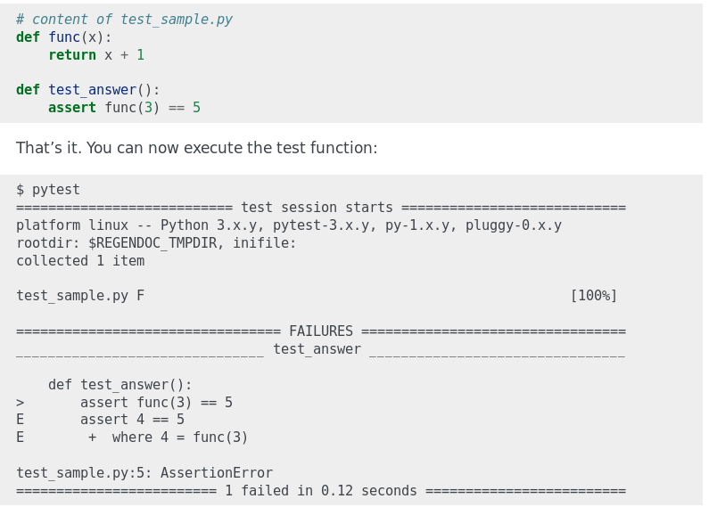

Desenvolvimento Aberto
===

##### Testes automatizados

###### Igor dos Santos Montagner ( [igorsm1@insper.edu.br](mailto:igorsm1@insper.edu.br) )

---

# Projeto profissional

* Qualidade de código
    * Linting - formatação e erros comuns
* Documentação
    * Usuário
    * Desenvolvedor

---

# Projeto profissional

* Qualidade de código
    * Linting - formatação e erros comuns
    * **O código funciona?**
* Documentação
    * Usuário
    * Desenvolvedor

----

# Meu programa funciona?

* Sob quais condições?
* Em quais plataformas?
* Quais operações são suportadas? 
* Consigo conferir o resultado de uma execução? Se sim, existe um valor de referência?

---

# Testes automatizados

**Ideia**: escrever um programa que verifica se um outro programa responde como esperado

* Definir situações a serem testadas ...
* e o resultado esperado em cada situação

---
# Testes automatizados

**Não ajudam**:

* a revelar novos bugs
* a garantir que um software é livre de bugs

**Ajudam**

* a evitar que bugs descobertos voltem
* a evitar que mudanças não intencionais quebrem código que estava funcionando.
* a documentar em quais situações o software funciona.

---

# Testes automatizados

1. Testes de unidade
2. Testes de integração
3. Testes de interface de usuário

---

# Testes unitários

**Ideia**: dada uma função, verificar se ela devolve o valor esperado para um certo conjunto de parâmetros. 

* Testa as funções de maneira **isolada**
* **Cobertura**: porcentagem das linhas de código que é executada durante os testes de unidade.
* Serve como documentação da função

---
# Testes unitários - pytest

---

# Testes de integração

**Ideia**: dados um conjunto de classes com interdependências, verificar se elas funcionam bem **em conjunto**. 

* Testa interação entre em objetos
* Possibilidade de criar *mocks*, que são objetos falsos feitos para simular a interação entre vários objetos. 

----

# Testes de interface de usuário

**Ideia**: simula ações do usuário (cliques, entrada de dados, etc) e confere se a saída esperada é mostrada na tela

* Menos específico possível 
* Mais fiel ao uso real de um usuário

---

# Testes de interface de usuário

## Selenium

Permite fazer scripts que interagem com uma página web, realizando entrada de dados, rolagem de tela e cliques. Cada `assert` pode ser feito com o conteúdo de um objeto da página. 

---

# O quê eu preciso testar?

## 

---

# O quê eu preciso testar?

## Ninguém sabe.... 

----

# Atividade prática: Testado e aprovado

**Objetivo**: Primeira experiência com testes automatizado de código.

> "metadata": {"url": "repo-servidor-desafios", "group": ["igual", "6"]}