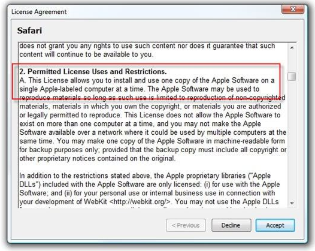
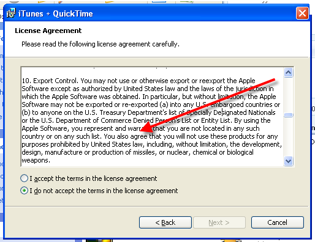
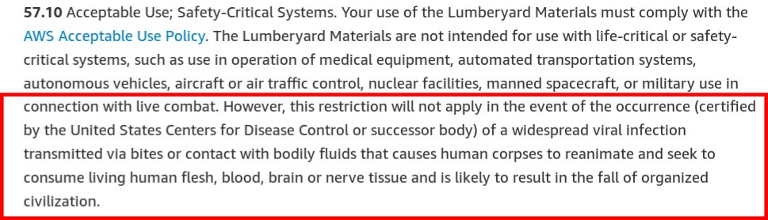

Desenvolvimento Aberto
===

##### Licenças de Software

###### Igor dos Santos Montagner ( [igorsm1@insper.edu.br](mailto:igorsm1@insper.edu.br) )

---
Até agora
=========

* Ferramentas de colaboração
* Modificações de código
* Tradução de UI e documentação
* Distribuiçao de software

 ### Conteúdo técnico: ferramentas, fluxos de trabalho, etc

----
# Hoje

## Licenças de software

---
# Licenças de software

* Governam a **distribuição** de um software
* Cessão de direitos do autor para outras pessoas
* Listam quais permissões um usuário (não) tem

----

# Disclaimer

## Eu não sou especialista em direito autoral brasileiro. Toda informação disponibilizada foi fruto de pesquisa e não constitui aconselhamento legal. 

---
# Distribuição de software

Escrever software é considerado um *trabalho intelectual*, estando então sujeito às leis de direitos autorais.

* Essas leis são específicas de cada país
* Autoria *vs* exploração econômica
* Engloba tanto código fonte como binários

---
# Direito autoral brasileiro

Não é necessário registro. Não vale para ideias. 

* **Direito moral**: 
	- assegura a autoria da obra ao autor original
	- integridade da obra
	- instransferível e irrevogável
* **Direito patrimonial**: 
	- exploração econômica da obra. 
	- licenciado ou cedido
	- **copyright** em inglês

---
# Por que isto é importante?

O dono dos direitos autorais (patrimoniais) pode controlar:

1. Distribuição, parcial ou total;
2. Criação de obras derivadas
3. Reprodução (execução)

---
# Por que isto é importante?

De quem é o código nos seguintes cenários?

	
### Um funcionário trabalhando para uma empresa produz sotfware durante o expediente. 

---
# Por que isto é importante?

De quem é o código nos seguintes cenários?

### Um funcionário trabalhando para uma empresa produz sotfware fora do expediente e decide lançar um produto não relacionado.

---
# Por que isto é importante?

De quem é o código nos seguintes cenários?

### Um funcionário trabalhando para uma empresa produz sotfware fora do expediente e decide lançar um produto concorrente.

---
# Por que isto é importante?

De quem é o código nos seguintes cenários?

### Um programador faz um freelance e entrega um projeto para uma empresa. Ele pode reutilzar parte do código em outros projetos (para outras empresas)?

---
# Por que isto é importante?

De quem é o código nos seguintes cenários?

### Um prestador de serviços (contratado como empresa via CNPJ) participa de um projeto terceirizado, junto com outros PJs. 

---
# Por que isto é importante?

Nenhum dos casos acima tem respostas fixas. Tudo depende de um monte de fatores jurídicos e do quê cada um assinou. Alguns guias interessantes:

* [Association of Software Professionals](https://asp-software.org/www/misv_resources/business-articles/who-owns-the-code/)
* [Start-se](https://www.startse.com/noticia/mercado/17252/cinco-cuidados-na-contratacao-de-desenvolvimento-de-software)
* [Legal Nature - EULA](https://help.legalnature.com/articles/the-basics-of-software-license-agreements)

----
# Contexto 1: Propriedade intelectual e *work-for-hire* 	

* Contexto brasilero: "Pela nossa lei de software, a não ser que expressamente dito o contrário, aquele que contrata o desenvolvimento é titular original do software resultante" [1]
* Contexto americano: *work-for-hire* determina que software feito sob encomenda pertence a quem contratou o serviço [2]

Fontes [1](https://www.startse.com/noticia/mercado/17252/cinco-cuidados-na-contratacao-de-desenvolvimento-de-software) [2](https://asp-software.org/www/misv_resources/business-articles/who-owns-the-code/)

---

# Contexto 2: projetos *open source* 

**Contributor License Agreement** é um documento de cessão de copyright (direitos de exploração comercial). 

* Dá ao projeto uma licença não exclusiva (normalmente) e irrevogável para o projeto explorar sua contribuição
* Mantém autoria
* Isenta o projeto de responsabilidades sobre suas contribuições

---
# Contexto 3: comercialização de software

**End User License Agreement**: Termo usado para aquelas condições que (não lemos) aceitamos ao instalar software proprietário ou nos registramos em um site/serviço.

# 

Ignorado por aproximadamente 90% dos usuários ([fonte](https://measuringu.com/eula/))

---
# End User License Agreement

E por algumas empresas... [Fonte](https://www.makeuseof.com/tag/10-ridiculous-eula-clauses-agreed/)

---
# End User License Agreement

E por algumas empresas... [Fonte](https://www.makeuseof.com/tag/10-ridiculous-eula-clauses-agreed/)

---
# End User License Agreement

Restrições típicas encontradas em EULAs:

* Software é licenciado, não vendido;
* É proibido engenharia reversa
* Não pode modificar ou explorar limitações / vulnerabilidades
* Isenta responsabilidades pelo (mau) uso do software

---
# EULA (serviços)

Informações típicas encontradas em EULAs de serviços:

* Restrições de idade;
* Uso dos dados coletados:
* Término unilateral do serviço
* Garantias de disponibilidade e responsabilidade

[Legal Nature - EULA](https://help.legalnature.com/articles/the-basics-of-software-license-agreements)

---
# EULA (AWS)

[fonte](https://aws.amazon.com/service-terms/): https://aws.amazon.com/service-terms/

---
# End User License Agreement

[fonte](https://xkcd.com/501/)

---
# Um pouco de história

Richard Stallman fez um interpretador Lisp (MIT ~ 1985)

---
# Um pouco de história

* Uma empresa chamada *Symbolics* licenciou o LISP do MIT para rodar em máquinas como a acima

---
# Um pouco de história

* Uma empresa chamada *Symbolics* licenciou o LISP do MIT para rodar em máquinas como a acima
* Fez modificações no software
* Deu um jeito de não devolvê-las para o MIT....
* E eliminou a competição...

---
# Um pouco de história

* Stallman ficou `#$@#$@#$@`
* e criou a primeira licença de software *livre*: *Emacs General Public License*

### Principal característica:

1. Toda cópia do programa deverá estar acompanhada do código fonte;
1. Se uma modificação do software for distribuída, ela deverá estar sujeita aos mesmos termos do software original;

--- 
# Um pouco de história - 1985

* [GNU Manifesto](https://www.gnu.org/gnu/manifesto.html): descrevia um esforço em criar um sistema completamente livre cujo destino estivesse nas mãos dos usuários
* GNU/Hurd: todas as ferramentas de linha de comando das distribuições modernas vieram desse projeto

--- 
# Um pouco de história - 1990

* Linus Torvalds tinha um kernel **experimental** "pronto".
* Liberava uma versão nova toda semana;
* Recebia contribuições de outros interessados.

---
# Um pouco de história

**Leitura complementar:** Free Software, Free Society: Selected Essays of Richard M. Stallman. 

---
# Um pouco de história

**Leitura complementar:** Just for Fun: The Story of an Accidental Revolutionary, Linus Torvalds and David Diamond

---
# Licenças de software (livre)

Criadas pela Free Software Foundation visando garantir 4 liberdades para um usuário ao usar um software:

0. Execução sem restrições
2. Estudo e modificação do software; 
3. Redistribuir cópias;
4. Redistribuir cópias das suas modificações.

**Distribuir os fontes é pré-requisito dos itens 1 e 3!**

Chamadas também de *recíprocas*.

---

# Licenças de software (livre)

---
# Licenças de software livre - recíprocas

**Copyleft**: Símbolo é o contrário do copyright, cujo objetivo seria restringir os usuários

---

# Open Source Iniciative

* Fundada para difundir um discurso menos anti-comercial e ideológico
* Também difunde benefícios "pragmáticos" do uso de software "de código aberto"
* *Free* causa confusão em inglês
	- Grátis (*free as in beer*) 
	- Livre (*free as in freedom*)
* Fundada por Eric Raymond e Bruce Perens

----

# Licenças de software de código aberto

Mais associadas a [Open Source Iniciative](http://opensource.org), são consideradas menos "ideológicas".

* Muitas vezes chamadas de *permissivas*;
* Normalmente não garatem a liberdade 4;
* Podem fazer outras pequenas exigências ou restrições

Exemplos: MIT, BSD

* Permitem a distribuição de software com partes proprietárias
* Permitem a venda e completo *rebranding* do software sem nenhuma contribuição para o autor original.

---
# Atividade

**Cultura livre**: fez uma pesquisa profunda e apresentou seminário sobre licenças de software e casos recentes em que licenças tem papel de destaque

### Sua apresentação não pode ser somente slides
* kahoot, socrative, etc
* debate
* painel com votações

---
# Atividade - sugestões de temas

* Epic vs Apple - distribuição de software em iOS
* Regulamentações recentes na Europa sobre durabilidade de smartphones (bateria, right to repair, etc)
* There is no "Linux" platform
* Telemetria é "ético"? (caso Audacity e outros)
* Maintainer burnout (caso Hacktober fest e outros)
* GitHub CoPilot é "ético"? Respeita licenças de software?

-----
# Atividade - datas de apresentação

* 23/11 - 2 trabalho
* 25/11 - 2 trabalhos
* 30/11 - 2 trabalhos

### 45 minutos de apresentação/atividade + 10 minutos para perguntas

---

# Hoje

* Definição de temas e datas de apresentação
* Prévia de 5 minutos do seu tema na próxima aula

### Registrar seu grupo, escolha de tema e dia de apresentação na issue `#369`

----

# Desafio de tradução **(21/09)**

### Skill "Tradução aceita!" *(5XP)*: Ao menos 40 string traduzidas

### Extra: "Sprint de tradução Elementary" *(15XP)*

----

Desenvolvimento Aberto
===

##### Licenças de Software

###### Igor dos Santos Montagner ( [igorsm1@insper.edu.br](mailto:igorsm1@insper.edu.br) )
