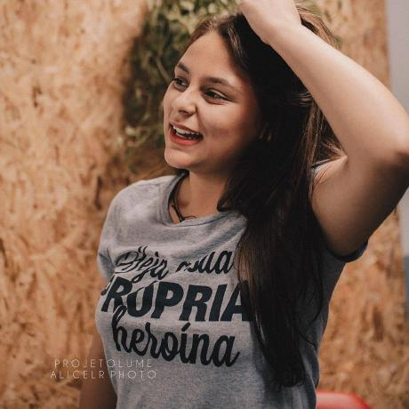

Open Source Development
===

# 

##### Course overview + Distributed coding workflow

###### Versão 2023/2: Igor Montagner ( igorsm1@insper.edu.br) )

---

# Burocracy

### Meetings

- MON 07:30 - 09:30
- WED 07:30 - 09:30

### Office Hours

- On demand

### Assessment
- Project based course with both individual and group work

---
# Learning Objectives

By the end of the course, the student will be able to:

- Analyze an unfamiliar medium/large codebase and modify it to make improvements and fix software issues.
- Interact with a remote team of developers to deliver code that meets the quality and code style standards of a project.
- Understand the differences in open-source software licenses and how they impact the distribution and reuse of a codebase.

---

# Objectives (summary version)

By the end of the course, the student will be able to:

- Download, understand, and **modify** the code of a project.
- Successfully have their modifications **accepted by the original project**.
- Understand aspects related to the **distribution** of software.
	- Licenses
	- Bug Tracker, Version Control, Governance, etc.
	- Documentation / Internationalization
	- User communities

---

# Course Syllabus

1. Software development and commercialization models.
2. Software licenses and their impact on reuse and distribution.
3. Tools for collaborative software development (open source or proprietary).
4. Software and code documentation.
5. Software translation and internationalization.
6. Source code compilation and distribution systems.
7. Human and community aspects in software development.
8. Case studies of successful projects.

---

# Textbook

Available online at [https://producingoss.com](https://producingoss.com/)

---

# Course Materials

GitHub: [https://github.com/insper/open-dev](https://github.com/insper/open-dev)

Website: [https://insper.github.io/open-dev/](https://insper.github.io/open-dev/)

Blackboard will be used for announcements only. All content will be available on GitHub.

---

# Justification for the Course

In previous courses, we worked on:

- Creating a new project.
- Projects that typically end after the course.
- Projects that are never used by anyone.

#

In the industry, we usually work on existing projects:

- Fixing issues.
- Making improvements.
- Projects used by multiple users.

---

# Why did I create the course?

----

# My motivation (Igor)

---

# My motivation (Igor)

---

# My motivation (Igor)

- I've worked **alone** for **5 years**
- I've spent countless hours writting
	- a scientific paper about it
	- documentation for users and developers

#

#

- **I** learned a lot by doing this
- I might have solved a problem no one has!

---

# My motivation (Igor)

## It's not enough (anymore) to create software for learning purposes

## I would like to have (some) impact

* To create/contribute to software other people use
* To write texts/tutorials that are read by someone
* To be a part of a community that would miss me if I stop participating

---

# Why are you here?

https://forms.gle/uDvnDoyxBsVoHy6S8

----

# Achievements in this Course So Far

---

# Vitória - 2018/2

## Spyder

- Accepted: [[1]](https://github.com/spyder-ide/spyder/pull/7698)

## Pandas

- Accepted: [[1]](https://github.com/pandas-dev/pandas/pull/22737)

---

# Paulo - 2018/2

## Cataclysm: DDA

- Accepted: [[1]](https://github.com/CleverRaven/Cataclysm-DDA/pull/25764)

---

# Class - 2019/2

## 15 students

## 19 different projects, 14 accepted PRs

## Pandas - 6 accepted contributions

---

---

# Class 2020/1

## 16 students

## 15 different projects, 17 accepted PRs

## Pandas, Matplotlib, Bokeh, Pygame

---

---

# Course Introduction

----

# Course Introduction

**Proposal**: The course will be *gamified*.

- Each student will create an *avatar* in the course.
- Activities for submission earn XP.
- Each activity is represented by a skill with a funny name.
- All work submissions are done via *Pull Request* on the course's repository.
- **Significant freedom of choice**

---

# Course Introduction (Skills)

* **Tutorial**: Guided preparatory activities in the classroom
* **Code**: Code contributions to external projects
* **Community**: Non-technical contributions that can benefit users and developers of a project, such as documentation and translations
* **Impact**: Significant results achieved by the student's participation in open projects

## [Full list of skills](https://insper.github.io/open-dev/assessment/)

---

# Course Introduction (syllabus)

- August/September: **Tutorial**
	- 30-60 minutes of lecture/discussions
	- Activities focused on specific topics
- October/November: Project
	- **Autonomy** to define which tasks will be done
	- Semi-free choice of projects

---

# Course Introduction (assessment)

* All submissions are individual.
* Each learning objective is measured by several skills.
	- Some skills are mandatory.
	- Repeating a skill can earn more or fewer points than the first time.
* Grades are based on the amount of *XP* obtained.
	- Freedom to decide where to invest time/effort.

---

# Course Introduction (assessment)

* Final grade is a combination of XP and acquired skills.
* Bi-weekly reports sent by email.
* Complete conditions on the [rules and skills page](https://insper.github.io/open-dev/assessment/).

---

# Discussion: Development Workflow

## How does Git work?

----

Source: https://www.slideshare.net/abderrahmanebenbachir/continuous-integration-in-github

---

Source: https://www.slideshare.net/abderrahmanebenbachir/continuous-integration-in-github

----

# Activity: First Steps

**Objective**: Submit your first *Pull Request* to the course's repository.

---

Open Source Development
===

# 

##### Course overview + Distributed coding workflow

###### Versão 2023/2: Igor Montagner ( igorsm1@insper.edu.br) )

