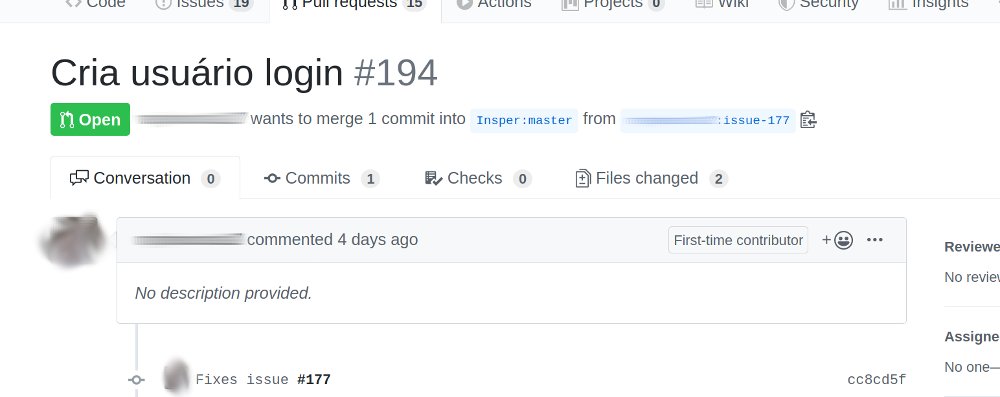

<style>
	footer {
		position: fixed;
		bottom: 10px;
		left: 1050px;
		width: 400px;
	}

	footer img {
		vertical-align: middle;
	}
</style>


Open Source Development
===

# 

##### Software and Communities


###### 2024/2: Fabricio Barth ( fabriciojb@insper.edu.br) )

-----
# Github Model: *fork + pull request*


Source: https://www.slideshare.net/abderrahmanebenbachir/continuous-integration-in-github


---

# Github Model: *fork + pull request*


Source: https://www.slideshare.net/abderrahmanebenbachir/continuous-integration-in-github

---

# Workflow: other models

1. Send patch via email list (e.g., Linux)
<!--2. *Code review* tools (e.g., KDE - Phabricator)-->
2. Patch is attached to the Bug Tracker (e.g., Haiku, KDE)
3. Does not receive external contributions

----


# Review of last class's PRs

## Common Errors

---

# Error 0: *login-achievements* file has errors


**Error**: The date of the commit is incorrect, for example. Then, when we run the command `python dev-aberto.py compute-grade <user>` the result is not as expected.

**How to fix**: Create a new commit with the correct content.

-----

# Error 1: Extra files in the PR

**Error**: Modifying files not related to your proposed changes.

#

**Ideal**:

1. A Pull Request should contain only the files related to the proposed modification.
2. Each proposed modification is in a separate Pull Request.

----


---

# Error 1: Extra files in the PR

**How to fix**: `git rm --cached <file>` removes the file from the repository, but keeps it in the working directory.

**How to fix**: `git revert <commit_id>` creates a commit that undoes the changes made by `commit_id`.

.svg?cdnVersion=501)

**Extra options**:

- `--no-commit`: Only adds the modifications, but does not make the commit. Allows undoing part of a commit.

Source: https://www.atlassian.com/git/tutorials/

----
# Error 2: Non-descriptive commit messages


**How to fix**: `git commit --amend` allows modifying the last commit made.

----
# Error 3: Pull Request with a poor description



**How to fix**: Simply edit it in the Github interface.

---

<!--

# Fix at home and request review via Github

* Reminder: If you don't push, nothing is broken

* Reminder II: `git log` shows your current history. I like `git log --oneline`
---

-->

# Not all students enrolled in the course did the activity from the last class!

```bash
python dev-aberto.py list-users
```

Please, do it as soon as possible!

---

# Software Communities

----
# Discussion

#
#

**Question 1**: What are the software you use the most in your daily life?

**Question 2**: Who is the main developer of the project?

**Question 3**: How do you think the project is funded?

----

# Example: Linux Kernel


Foundation supports the development of the Linux Kernel and the creation of an open-source software ecosystem around it.

Support:

- Financial
- Intellectual property
- Infrastructure
- Services and training

---
# Example: Linux Kernel

Companies that sponsor development:

1. Individual (11.95%)
2. Intel (10.01%)
3. Red Hat (8.90%)
4. Unknown (4.09%)
5. IBM (3.79%)
6. SUSE (3.49%)
7. Linaro (2.96%)
8. Consultants (2.96%)
9. Google (2.79%)
10. Samsung (2.28%)

Source: "2020 Linux Kernel Development Report"

---
# Example: Ubuntu


Private company controls the development of Ubuntu. Obtains resources via:

- Donations
- Development and consulting services
- Training

---
# Example: Gitlab


Company funded so far by VC (Venture Capital) in search of profit.

- Option of free plans with open-source software
- Option of corporate plans with more features and **support**
- On-premises installations

---
# Example: Elementary

#


#

Linux distribution led by a "tiny" company focused on the user experience. Resources are obtained through:

- Individual and corporate sponsorships
- Pay-what-you-want model (app store and operating system)
- Hardware with the pre-installed system

---


---


# Reasons for funding (company)
#
- "Acquire" experts in a technology
- Sell support or consulting services
- Marketing
<!-- - Software license "obliges"

Not everything funded ends up in a "usable" format for others (e.g., Android/Linux, TiVO)

---

*"Tivoization is the practice of designing hardware that incorporates software under the terms of a copyleft software license like the GNU General Public License (GNU GPL), but uses hardware restrictions or digital rights management (DRM) to prevent users from running modified versions of the software on that hardware"* [Wikipedia]

-->

---
# Reasons for contributing (individual)

- Professional
	- Reputation / CV
	- Business needs
- Personal
	- Altruism / Ideology
	- Sense of personal fulfillment
	- Exercise creativity
	- Solve a problem of personal interest

---
# Activity: Exploring the environment of a project


- Research how the communities of some projects are organized
- Produce a presentation summarizing your findings
------------

Open Source Development
===

# 

##### Software and Communities

