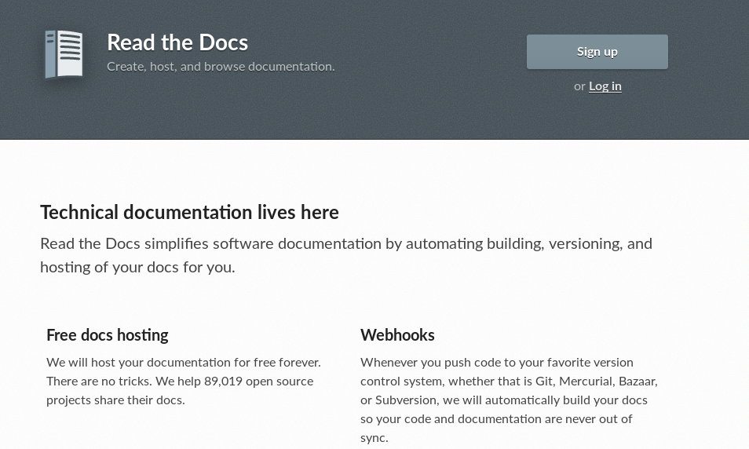

Desenvolvimento Aberto
===

##### Documentação de software

###### Versão 2024/2 - Fabricio Barth (fabriciojb@insper.edu.br)
---

# Documentação de software

**Documentação de usuário**:

#

#

#

**Documentação de desenvolvimento**:

#

#

#

---
# Documentação de software

**Documentação de usuário**:

- Instalação
- Funcionalidades
- Onde obter ajuda

---
# Documentação de software

**Documentação de desenvolvimento**:

- Como compilar (dependências, ferramentas usadas, etc)
- Como testar (dependências, ferramentas usadas, etc)
- Estilo de código e outras orientações relacionadas
- Organização do código e arquitetura da aplicação

---
# Documentação de software

Às vezes as coisas se confundem! O que vocês colocariam na documentação de usuário do *Python*?

E na de desenvolvedor?

---
# Exemplo: Spyder

https://www.spyder-ide.org/

---
# Exemplo: Spyder

https://github.com/spyder-ide/spyder/wiki

---
# Sistemas de documentação

[Sphinx](http://www.sphinx-doc.org/en/master/)

---
# Sistemas de documentação

[Mkdocs](www.mkdocs.org)

---
# Sistemas de documentação (hospedagem)

[https://readthedocs.org/](https://readthedocs.org/)

---

# Atividade

Vocês receberão um *zip* com o código de um software e zero instruções. Vocês deverão:

1. Aprender como rodar o software
2. Documentar os passos que vocês seguiram para fazê-lo
3. Fazer uma análise crítica do projeto com relação a
	- Arquitetura
	- Qualidade do código
	- Segurança da solução

---

# Objetivos desta atividade

1. Entender na prática a necessidade de documentação;
2. Identificar quais são as dependências de um software. Isto inclui bibliotecas/frameworks usados e serviços aos quais esse software se conecta.
3. Rodar sua própria versão de um software de terceiros

---

# Não são objetivos desta atividade

1. Mostrar nenhum tipo de boa prática de programação
2. Modificar o software analisado
3. Criticar o desenvolvedor que trabalhou antes no projeto

---
# Atividade prática: Projeto não documentado

**Objetivo**: entender como rodar um código sem instruções. 

**Validação**: apresentação do sistema funcionando. 

**Grupos de até 3 pessoas**

#### Tempo restante de hoje

---

Desenvolvimento Aberto
===

##### Documentação de software

###### Versão 2024/2 - Fabrício Barth (fabriciojb@insper.edu.br)
