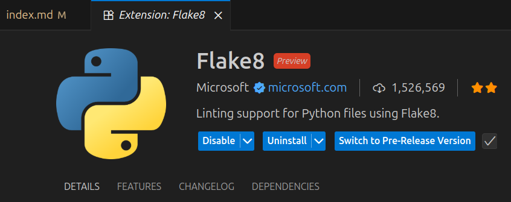

# 07 - Code quality

In Lesson [04 - Professional Project](../04-professional-project) we created a repo and website for an old project developed during the course. Now we are going to improve its quality by fixing the issues from each group by using a **linter** tool. 

**Linters** analyze your code for potential errors, enforce coding standards, improve readability and security. They are useful tools to ensure high-quality of coding. Some popular Python linter tools:

1. **Flake8:**
Combines tools like PyFlakes, pycodestyle, and McCabe.
Detects syntax errors, style guide violations (PEP 8), and cyclomatic complexity.
Lightweight and easy to integrate into CI/CD pipelines.

2. **Pylint:**
Comprehensive linter that checks for errors, enforces coding standards, and suggests code refactoring.
Provides a detailed score for your code quality.
Highly configurable, but may require some setup to avoid excessive warnings.

!!! warning
    We won't work on our **own** projects this time! Select a project from [ongoing projects page](../../projects/2025/2/index.md) and comment on the issue you'd like to do or create a new issue that you'd like to work on. Every project must have at least one issue with external participation. 

## Deliverable

{ style="height:150px" }

- create a Pull/Merge request addressing a code quality issue found in another team's project. 
- work with other team to get a Pull/Merge request accepted in your repository.

**Learning objective**: modify a project you are not familiar with and improve its code quality.

> "skill_id": 11, "metadata": {"url": "pull request url", "group": ["student2"]}

Add to the pull request description a link to the accepted contribution. 
