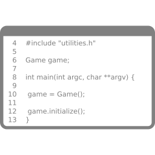

Open Development
===

# 

##### Code Contribution

###### Igor dos Santos Montagner ( [igorsm1@insper.edu.br](mailto:igorsm1@insper.edu.br) )

---
# So far

- Collaboration tools
- Code quality and tools for project quality
- UI and documentation translation
- Related non-technical aspects
    - Licenses
    - Communities
----

# First contribution

- Help with *issue* and project selection
- Will be done in pairs/trios

**Final due date**: **October 20th**

----
# Individual stage (October)

## Deepen skills developed in groups

1. Provide work experience on a real project **of the students' choice**
2. Value different types of contributions, not just code
3. Exercise **autonomy** and **independence**

### Starting on 10/20

----

# My first code contribution

Good projects use tags to facilitate welcoming newcomers

- good-first-issue
- newcomers
- low effort
- difficulty novice
- easy

----

# Suggestion I - Pandas

Data processing library used in Data Science.

- Complex project, with many special use cases
- Tons of textual and graphical data visualization features
- Python is familiar to most

[Test tickets](https://github.com/pandas-dev/pandas/labels/Needs%20Tests) are generally easy to get started with and useful for the community.

-----

# Suggestion II - Matplotlib

Plotting graphs in Python

The [Good first issues](https://github.com/matplotlib/matplotlib/issues?q=is%3Aissue+is%3Aopen+label%3A%22Good+first+issue%22) list has several open issues or PRs that have been stalled for months and can be taken over by others.

------

# Suggestion III - Pyscript

Python running in the browser via WebAssembly

[Issue List](https://github.com/pyscript/pyscript/issues) has several that seem accessible.

----

# Suggestion III: Choose your own project :)

- https://github.com/MunGell/awesome-for-beginners
- https://www.codetriage.com/
- https://up-for-grabs.net/
- http://github-help-wanted.com/

----

# Today

1. Choose an issue and project
1. Set up an environment
	- download the code
	- compile
	- run your version
1. Reproduce the issue

