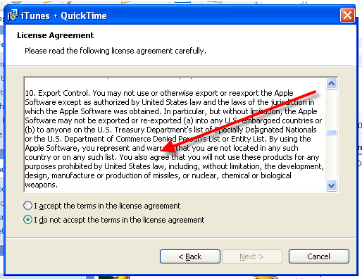
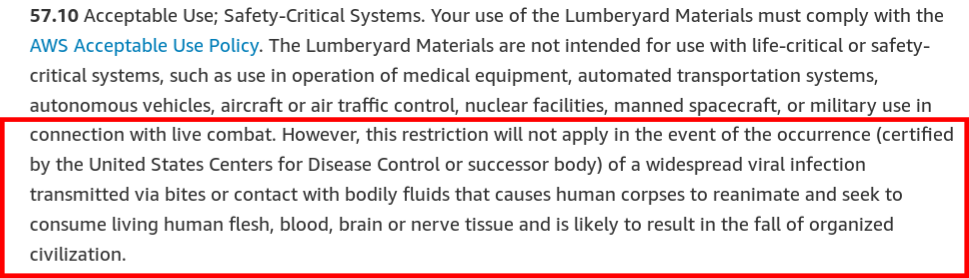
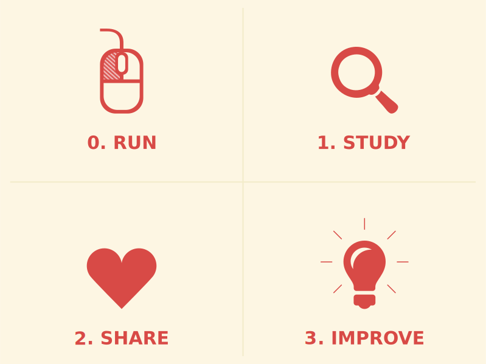

Desenvolvimento Aberto
===

##### Licenças de Software

###### 2023/2: Igor Montagner ( igorsm1@insper.edu.br) )

---
Até agora
=========

- Ferramentas de colaboração
- Modificações de código
- Tradução de UI e documentação
- Distribuiçao de software
- Teste de software

 ### Conteúdo técnico: ferramentas, fluxos de trabalho, etc

----
# Hoje

## Licenças de software

---
# Licenças de software

- Governam a **distribuição** de um software
- Cessão de direitos do autor para outras pessoas
- Listam quais permissões um usuário (não) tem

----

# Disclaimer

## Eu não sou especialista em direito autoral brasileiro. Toda informação disponibilizada foi fruto de pesquisa e não constitui aconselhamento legal. 

---
# Distribuição de software

Escrever software é considerado um *trabalho intelectual*, estando então sujeito às leis de direitos autorais.

- Essas leis são específicas de cada país
- Autoria *vs* exploração econômica
- Engloba tanto código fonte como binários

---
# Direito autoral brasileiro

Não é necessário registro. Não vale para ideias. 

* **Direito moral**: 
	- assegura a autoria da obra ao autor original
	- integridade da obra
	- instransferível e irrevogável
* **Direito patrimonial**: 
	- exploração econômica da obra. 
	- licenciado ou cedido
	- **copyright** em inglês

---
# Por que isto é importante?

O dono dos direitos autorais (patrimoniais) pode controlar:

1. Distribuição, parcial ou total;
2. Criação de obras derivadas
3. Reprodução (execução)

---
# Por que isto é importante?

De quem é o código nos seguintes cenários?

	
### Um funcionário trabalhando para uma empresa produz sotfware durante o expediente. 

---
# Por que isto é importante?

De quem é o código nos seguintes cenários?

### Um funcionário trabalhando para uma empresa produz sotfware fora do expediente e decide lançar um produto não relacionado.

---
# Por que isto é importante?

De quem é o código nos seguintes cenários?

### Um funcionário trabalhando para uma empresa produz sotfware fora do expediente e decide lançar um produto concorrente.

---
# Por que isto é importante?

De quem é o código nos seguintes cenários?

### Um programador faz um freelance e entrega um projeto para uma empresa. Ele pode reutilzar parte do código em outros projetos (para outras empresas)?

---
# Por que isto é importante?

De quem é o código nos seguintes cenários?

### Um prestador de serviços (contratado como empresa via CNPJ) participa de um projeto terceirizado, junto com outros PJs. 

---
# Por que isto é importante?

Nenhum dos casos acima tem respostas fixas. Tudo depende de um monte de fatores jurídicos e do quê cada um assinou. Alguns guias interessantes:

- [Association of Software Professionals](https://asp-software.org/www/misv_resources/business-articles/who-owns-the-code/)
- [Start-se](https://www.startse.com/noticia/mercado/17252/cinco-cuidados-na-contratacao-de-desenvolvimento-de-software)
- [Legal Nature - EULA](https://help.legalnature.com/articles/the-basics-of-software-license-agreements)

----
# Contexto 1: Propriedade intelectual e *work-for-hire* 	

- Contexto brasilero: "Pela nossa lei de software, a não ser que expressamente dito o contrário, aquele que contrata o desenvolvimento é titular original do software resultante" [1]
- Contexto americano: *work-for-hire* determina que software feito sob encomenda pertence a quem contratou o serviço [2]

Fontes [1](https://www.startse.com/noticia/mercado/17252/cinco-cuidados-na-contratacao-de-desenvolvimento-de-software) [2](https://asp-software.org/www/misv_resources/business-articles/who-owns-the-code/)

---

# Contexto 2: projetos *open source* 

**Contributor License Agreement** é um documento de cessão de copyright (direitos de exploração comercial). 

- Dá ao projeto uma licença não exclusiva (normalmente) e irrevogável para o projeto explorar sua contribuição
- Mantém autoria
- Isenta o projeto de responsabilidades sobre suas contribuições

---
# Contexto 3: comercialização de software

**End User License Agreement** (**EULA**): Termo usado para aquelas condições que (não lemos) aceitamos ao instalar software proprietário ou nos registramos em um site/serviço.

# 

Ignorado por aproximadamente 90% dos usuários ([fonte](https://measuringu.com/eula/))

---
# End User License Agreement

E por algumas empresas... [Fonte](https://www.makeuseof.com/tag/10-ridiculous-eula-clauses-agreed/)

---
# End User License Agreement

Restrições típicas encontradas em EULAs:

- Software é licenciado, não vendido;
- É proibido engenharia reversa
- Não pode modificar ou explorar limitações / vulnerabilidades
- Isenta responsabilidades pelo (mau) uso do software

---
# EULA (serviços)

Informações típicas encontradas em EULAs de serviços:

- Restrições de idade;
- Uso dos dados coletados:
- Término unilateral do serviço
- Garantias de disponibilidade e responsabilidade

[Legal Nature - EULA](https://help.legalnature.com/articles/the-basics-of-software-license-agreements)

---
# EULA (AWS)

[fonte](https://aws.amazon.com/service-terms/): https://aws.amazon.com/service-terms/

---

# Um pouco de história

--- 

# Um pouco de história - 1985

- [GNU Manifesto](https://www.gnu.org/gnu/manifesto.html): descrevia um esforço em criar um sistema completamente livre cujo destino estivesse nas mãos dos usuários
- GNU/Hurd: todas as ferramentas de linha de comando das distribuições modernas vieram desse projeto
- Desenvolvimento e distribuição centralizada

--- 
# Um pouco de história - 1990

- Linus Torvalds tinha um kernel **experimental** "pronto"
- Liberava uma versão nova toda semana
- Recebia contribuições de outros interessados
- Desenvolvimento e distribuição participativos

---
# Um pouco de história

**Leitura complementar:** Free Software, Free Society: Selected Essays of Richard M. Stallman. 

---
# Um pouco de história

**Leitura complementar:** Just for Fun: The Story of an Accidental Revolutionary, Linus Torvalds and David Diamond

---
# Licenças de software (livre)

Criadas pela Free Software Foundation visando garantir 4 liberdades para um usuário ao usar um software:

0. Execução sem restrições
2. Estudo e modificação do software; 
3. Redistribuir cópias;
4. Redistribuir cópias das suas modificações.

**Distribuir os fontes é pré-requisito dos itens 1 e 3!**

Chamadas também de *recíprocas*.

---

# Licenças de software (livre)

---
# Licenças de software livre - recíprocas

- **Copyleft**: Símbolo é o contrário do copyright, cujo objetivo seria restringir os usuários
- muitos apoiadores também tem uma postura anti-comercial
- obriga a contribuição de volta para a comunidade
- procura empoderar TODOS os envolvidos na comunidade
- Principal figura: Richard Stallman

---

# Open Source Iniciative

- Fundada para difundir um discurso menos anti-comercial e ideológico
- Também difunde benefícios "pragmáticos" do uso de software "de código aberto"
- *Free* causa confusão em inglês
	- Grátis (*free as in beer*) 
	- Livre (*free as in freedom*)
- Fundada por Eric Raymond e Bruce Perens

----

# Licenças de software de código aberto

Mais associadas a [Open Source Iniciative](http://opensource.org), são consideradas menos "ideológicas".

- Muitas vezes chamadas de *permissivas*;
- Normalmente não garatem a liberdade 3;
- Podem fazer outras pequenas exigências ou restrições

Exemplos: MIT, BSD

- Permitem a distribuição de software com partes proprietárias
- Permitem a venda e completo *rebranding* do software sem nenhuma contribuição para o autor original.

---

# Licenças: qual usar? 

https://choosealicense.com/licenses/

----

Desenvolvimento Aberto
===

##### Licenças de Software

###### 2023/2: Igor Montagner ( igorsm1@insper.edu.br) )
