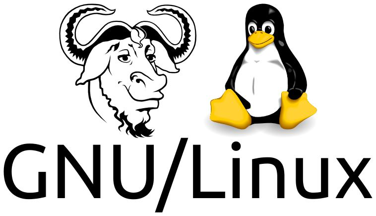
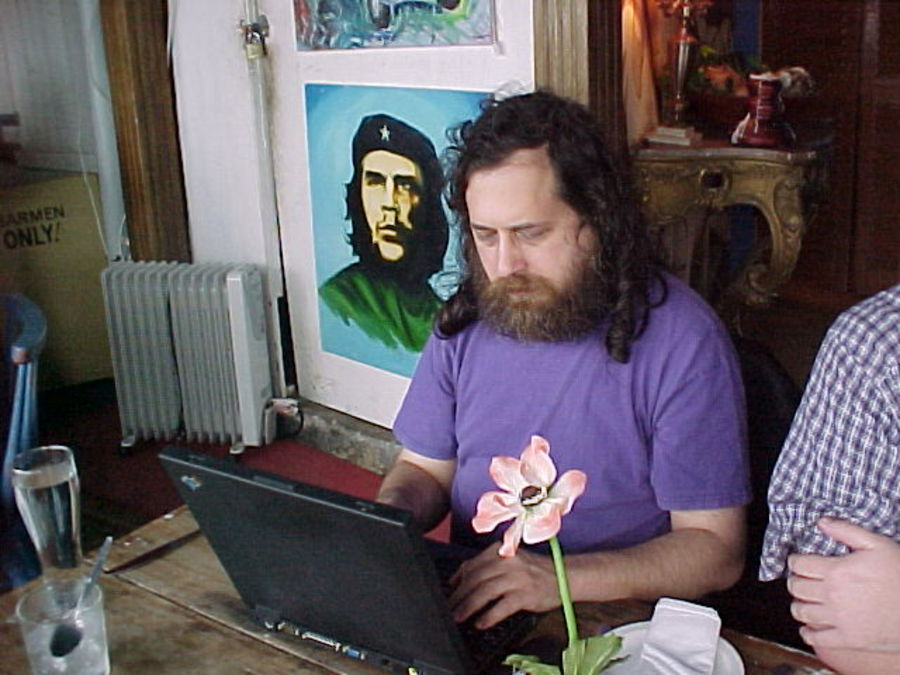
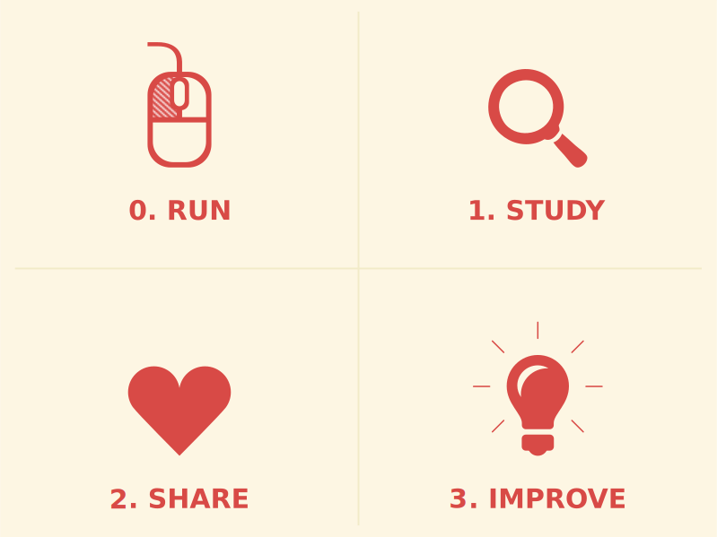

Open Source Development
===

##### Software Licenses

###### 2025/2: Igor Montagner ( igorsm1@insper.edu.br) )

---

So far
=========

- Collaboration tools
- Code modifications
- UI and documentation translation
- Software distribution
- Software testing

 ### Technical content: tools, workflows, etc.

----
# Today

## Software licenses

---
# Software licenses

- Govern the **distribution** of software
- Assignment of copyright to others
- List which permissions a user (does not) have

---
# Software Distribution

Writing software is considered an *intellectual work* and is therefore subject to copyright laws.

- These laws are country-specific
- Authorship *vs* Economic Exploitation
- Encompasses both source code and binaries

---

# A Little History

---

# A Little History - 1985

- [GNU Manifesto](https://www.gnu.org/gnu/manifesto.html): described an effort to create a completely free system whose fate was in the hands of users
- GNU/Hurd: all command-line tools in modern distributions came from this project
- Centralized development and distribution

---
# A Little History - 1990

- Linus Torvalds had an experimental kernel "ready"
- Released a new version every week
- Received contributions from others stakeholders
- Participatory Development and Distribution

---
# A Little History

**Further Reading:** Free Software, Free Society: Selected Essays of Richard M. Stallman.

---
# A Little History

**Further Reading:** Just for Fun: The Story of an Accidental Revolutionary, Linus Torvalds and David Diamond

---
# Free Software Licenses

Created by the Free Software Foundation to guarantee four freedoms for users when using software:

1. Unrestricted Execution
2. Study and Modify the Software;
3. Redistribute Copies;
4. Redistribute Copies of Your Modifications

**Distributing the sources is a prerequisite for items 2 and 3!**

Also called *reciprocal*.

---

# Free Software Licenses

---
# Free Software Licenses - Reciprocal

- **Copyleft**: This symbol is the opposite of copyright, whose purpose would be to restrict users
- Many supporters also have an anti-commercial stance
- Requires contributions back to the community
- Seeks to empower ALL those involved in the community
- Main figure: Richard Stallman

---

# Open Source Initiative

- Founded to spread a less anti-commercial and ideological discourse
- Also promotes the "pragmatic" benefits of using "open source" software
- *Free* causes confusion in English
- Free (*free as in beer*)
- Free (*free as in freedom*)
- Founded by Eric Raymond and Bruce Perens

----

# Open Source Software Licenses

More closely associated with the [Open Source Initiative](http://opensource.org), these are considered less "ideological."

- Often called *permissive*;
- Typically do not guarantee freedom;
- May impose other minor requirements or restrictions.

Examples: MIT, BSD

- Allow the distribution of software with proprietary parts.
- Allow the sale and complete *rebranding* of the software without any contribution to the original author.

---

# Licenses: Which one to use?

[choosealicense.com](https://choosealicense.com/)

----

Open Source Development
===

##### Software Licenses

###### 2023/2: Igor Montagner (igorsm1@insper.edu.br)