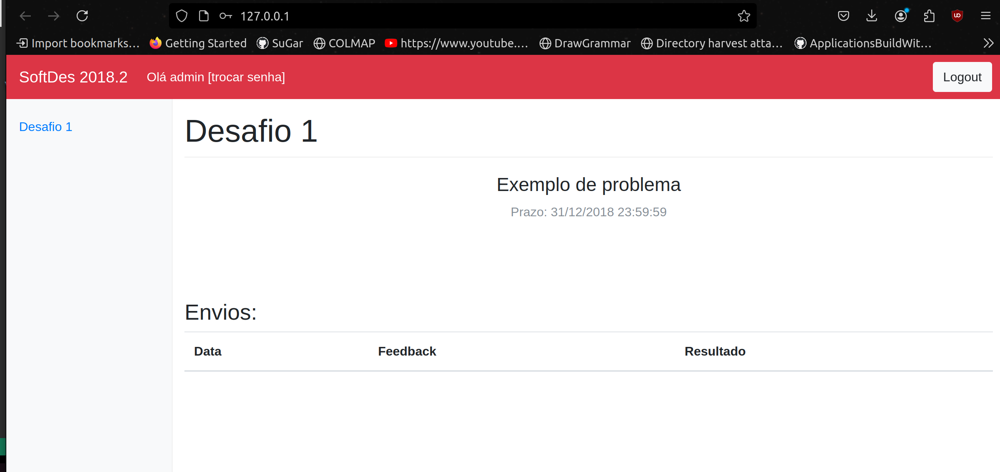

# Documentação da Aplicação

## 1. Visão Geral

A aplicação utiliza:

- Python3
- SQLite3 para o banco de dados
- Flask para o servidor
- Bootstrap para o front-end

## 2. Banco de Dados

1. O banco de dados utilizado na aplicação é SQL e sqlite3 é utilizado para se comunicar com o banco. As funções que conversam com o banco de dados estão definidas no arquivo softdes e são uma série de setters e getters.
2. A aplicação busca a db em "./quiz.db".
3. As Tabelas no banco são: "USER", "QUIZ" e "USERQUIZ".
4. As tabelas são criadas por meio do script quiz.sql.

## 3. Autenticação

1. A aplicação utiliza autenticação por nome e senha, por meio da biblioteca flask_httpauth, um objeto auth é criado por meio dessa biblioteca que então é usado em todos endpoints.
2. Os usuários "fabioja" ou "admin" têm permissões de admin.

## 4. Passo a passo para rodar a aplicação

1. Alterei o users.csv para "admin,admin"
2. Executei:
   ```
   sqlite3 quiz.db < quiz.sql
   python3 adduser.py
   sudo su
   pip install flask
   pip install flask_httpauth
   python3 softdes.py
   ```
3. Acessei 127.0.0.1, inseri "admin,admin"

## 5. Funcionalidade

Pelo que é possível observar, a aplicação foi desenvolvida com o intuito de apresentar as tarefas que precisam ser desenvolvidas e entregues pelo usuário que fez login na plataforma. Ela é capaz de listar os problemas e apresentar as datas de entrega, resultados e feedbacks de trabalhos já entregues.


## 6. Documentação para desenvolvedor do projeto.
Para subir a aplicação, o usuário deve:
 - Baixar as dependências necessárias como root(python3, flask, flask_httpauth, sqlite3)
 - Executar o quiz.sql com o sqlite3 para iniciar a DB
 - Editar a base de dados para adicionar um arquivo de
 - Executar o softdes.py